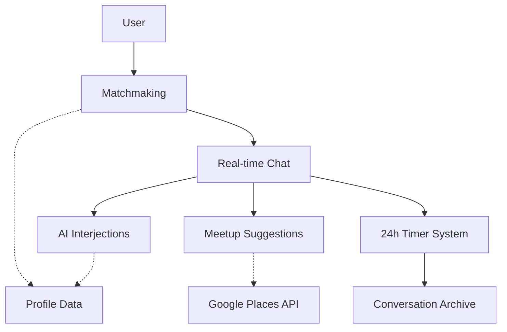

# Kintsu System Overview

**Version:** 1.0.0 | **Last Updated:** 2026-03-02

## What is Kintsu?

Social matchmaking app where AI persona "Trio" facilitates 1:1 conversations between matched users.

Features: AI matchmaking, real-time chat with 24h timer, context-aware AI interjections, and verified venue suggestions for offline meetups.

## Tech Stack

- **Frontend:** Next.js 14 App Router, TypeScript (strict), Tailwind v4, Framer Motion
- **Backend:** Next.js Server Actions, Supabase (PostgreSQL + Auth + Realtime)
- **AI:** Google Gemini 2.5 (Flash for speed, Pro for evaluation)
- **External APIs:** Google Places API (New) Text Search

## System Map

## Core Concepts

| Concept           | Definition                                                                 |
| ----------------- | -------------------------------------------------------------------------- |
| **Trio**          | AI persona that interjects in conversations (system user, not participant) |
| **Kintsu**        | AI matchmaker persona that asks discovery questions                        |
| **Match Request** | State machine for matchmaking (chatting→searching→pending→accepted)        |
| **Timer**         | 24h countdown that clears when both users message (saves conversation)     |
| **Interested**    | Double-blind interest indicator (☕ button) — reveals only when both click |

## Spec Index

### Shared References

- [Glossary](./shared/glossary.md) — Domain terms and concepts
- [Conventions](./shared/conventions.md) — Coding standards and patterns

### Data Models

- [Profile](./data-models/profile.md) — User identity and preferences
- [Conversation](./data-models/conversation.md) — Chat session metadata
- [Message](./data-models/message.md) — Individual chat messages
- [MatchRequest](./data-models/match-request.md) — Matchmaking state machine
- [Participant](./data-models/participant.md) — Conversation membership

### Features

- [Matchmaking Flow](./features/matchmaking-flow.md) — Conversational discovery → match selection
- [Chat Messaging](./features/chat-messaging.md) — Real-time message exchange
- [Timer System](./features/timer-system.md) — 24h expiry and archiving
- [AI Interjections](./features/ai-interjections.md) — Trio evaluation and generation
- [Meetup Suggestions](./features/meetup-suggestions.md) — 3-stage RAG pipeline
- [Interest Tracking](./features/interest-tracking.md) — Double-blind interest mechanism

### API (Server Actions)

- [Matchmaker Actions](./api/matchmaker-actions.md) — chatWithMatchmaker, findMatch, respondToMatch
- [Chat Actions](./api/chat-actions.md) — sendMessage, getMessages, getConversations
- [Profile Actions](./api/profile-actions.md) — Profile CRUD operations
- [Suggestion Actions](./api/suggestion-actions.md) — generateMeetupSuggestion, markInterested

### Infrastructure

- [Supabase Patterns](./infrastructure/supabase-patterns.md) — Client types, RLS, real-time
- [AI Integration](./infrastructure/ai-integration.md) — Gemini API patterns, retry logic
- [Authentication](./infrastructure/authentication.md) — Supabase Auth patterns
- [Error Handling](./infrastructure/error-handling.md) — Error patterns and logging

## Quick Start for Agents

1. Read [Glossary](./shared/glossary.md) for domain language
2. Review [Data Models](./data-models/) to understand entities
3. Pick a feature spec to implement (each is self-contained)
4. Reference [Conventions](./shared/conventions.md) for code style
5. Use [API specs](./api/) for server action contracts
