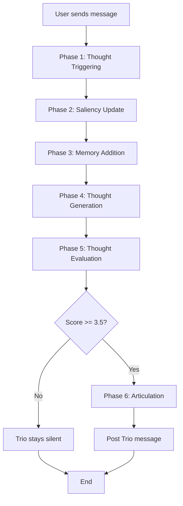

# Trio Cognitive Workflow - Adaptation Plan

**Based on:** "Proactive Agents with Inner Thoughts" framework
**Adapted for:** Kintsu AI (Trio) - Social friction reduction in 1:1 matchmaking conversations
**Version:** 1.0
**Date:** 2026-03-23

---

## Executive Summary

This plan adapts the dual-process cognitive framework from "Proactive Agents with Inner Thoughts" to create a sophisticated monitoring and interjection system for Trio, the AI facilitator in Kintsu conversations.

**Key Adaptation:** Transform a multi-agent competitive system into a single-agent monitoring system focused on reducing social friction and highlighting shared interests.

---

## System Overview

---

## Core Adaptations from Paper

| Paper Framework | Trio Adaptation | Rationale |
|-----------------|-----------------|-----------|
| Multi-agent competition | Single agent monitoring | Trio is only AI; humans are passive |
| Turn-taking prediction | Threshold-based decision | No speaker competition needed |
| 9-factor intrinsic motivation | 5-factor social facilitation score | Focus on Trio's specific goals |
| Generic conversation | Profile-aware connection-making | Leverage user interests/bio |
| Agent's own memories | User profile knowledge | Trio remembers user details, not own experiences |
| Dual-process generation | Simplified dual-process | Keep System 1/2 but adapt to facilitation role |

---

## Phase-by-Phase Workflow

### Phase 1: Thought Triggering

**Entry Point:** After user message is inserted into database

**Purpose:** Determine if Trio should process this message at all

**Trigger Conditions:**
1. Message must be from a human user (not Trio)
2. Last message was NOT from Trio (prevent consecutive speaking)
3. Conversation must be active (not archived)

**Decision:** If all conditions met → proceed to Phase 2. Otherwise, skip entire workflow.

---

### Phase 2: Saliency Recalibration

**Purpose:** Update relevance scores of Trio's knowledge about users based on the current message

**What Trio "Knows":**
- **User Profiles:** Each user's interests, bio, and identified shared interests ("Spark Points")
- **Recent Messages:** Last 10 messages from the conversation
- **Previous Thoughts:** Thoughts Trio has had about this conversation

**Process:**
1. Compute semantic embedding of the new message
2. Calculate similarity between message and each interest/bio point for both users
3. Update saliency scores using cosine similarity with decay factor
4. Update saliency of previous thoughts based on relevance to new message

**Decay Factors:**
- Profile knowledge: Slow decay (0.99) - stable interests remain relevant longer
- Previous thoughts: Faster decay (0.95) - old ideas become less relevant quickly

**Outcome:** Every piece of Trio's knowledge now has an updated relevance score (0.0-1.0+) indicating how pertinent it is to the current conversation state.

---

### Phase 3: Memory Addition

**Purpose:** Add the current message to Trio's short-term memory for future reference

**Process:**
1. Generate semantic interpretation of the message (not just content, but meaning/intent)
2. Create embedding of both content and interpretation
3. Add message to short-term memory buffer with initial saliency of 1.0 (maximally relevant)
4. Maintain rolling window of last 10 messages (remove oldest if full)

**Message Interpretation:**
The interpretation extracts deeper meaning beyond literal text:
- Emotional tone (enthusiastic, hesitant, awkward)
- Connection signals (showing interest, asking questions)
- Friction points (confusion, disagreement, topic mismatch)
- Interest mentions (explicit or implicit references to hobbies/activities)

**Outcome:** Trio now has context-rich memory of the conversation, not just raw text.

---

### Phase 4: Thought Generation (Dual-Process)

**Purpose:** Generate multiple candidate thoughts about how Trio could respond

This phase uses two parallel cognitive processes inspired by human thinking:

#### System 1: Quick Social Reactions

**Characteristics:**
- Fast, automatic, intuitive
- Based on immediate conversation patterns
- Generic social facilitation responses
- Brief (< 15 words)

**Types of System 1 Thoughts:**
- Notice awkward silence or social friction
- Spot quick connection opportunity
- Sense energy shift (positive or negative)
- Reflexive encouragement ("You two should totally do that!")

**Input Context:** Last 3 messages only

**LLM Parameters:**
- Temperature: 0.8 (high spontaneity)
- Output: Single thought + category (encouragement | connection | friction_reduction)

#### System 2: Deliberate Connection-Making

**Characteristics:**
- Slow, deliberate, memory-based
- Draws on user profiles and salient interests
- Specific to users' shared interests
- Generates 2 diverse thoughts

**Types of System 2 Thoughts:**
- Identify shared interests being discussed
- Bridge profile elements (e.g., "hiking" + "photography" → "trail photography")
- Address friction points with specific suggestions
- Nudge toward offline meetup at relevant venue

**Input Context:**
- Last 5 messages
- Top 5 salient interests (from both users' profiles)
- Top 3 salient previous thoughts
- Full user profiles (bio, interests)

**LLM Parameters:**
- Temperature: 0.5 (balanced creativity and consistency)
- Output: Array of thoughts with categories and stimuli references

**Stimuli Tracking:**
Each System 2 thought cites which inputs inspired it (e.g., "INT#3" for Interest #3, "MSG#5" for Message #5). This creates an auditable chain showing WHY Trio had this thought.

**Parallelization:**
System 1 and System 2 run concurrently to reduce latency. Total: 3 candidate thoughts (1 System 1 + 2 System 2).

---

### Phase 5: Thought Evaluation

**Purpose:** Score each thought on "Social Facilitation Motivation" (1.0-5.0 scale)

This determines HOW MOTIVATED Trio is to express each thought.

#### Evaluation Factors (5 Total)

**Internal Factors (Trio's Role):**

1. **Connection Relevance (a):**
   How well does this thought connect to BOTH users' profiles? Does it highlight genuine shared interests, or is it generic?

2. **Friction Severity (b):**
   How much social awkwardness/friction does this thought address? Is the conversation flowing fine, or is there a silence/mismatch?

3. **Timing Urgency (c):**
   Is this the right moment to speak? Would waiting be better, or is this thought time-sensitive?

**External Factors (Social Appropriateness):**

4. **Conversation Coherence (d):**
   Does this thought fit naturally into the conversation flow, or does it feel random/forced?

5. **Interjection Balance (e):**
   How recently did Trio last speak? Is Trio at risk of being annoying by speaking too much?

#### Rating Scale

- **1.0 (Very Low):** Stay completely silent, conversation flowing perfectly fine
- **2.0 (Low):** Minor opportunity, not urgent, could wait
- **3.0 (Neutral):** Could speak or stay quiet, roughly equal value
- **4.0 (High):** Strong opportunity to help, should speak now
- **5.0 (Very High):** Critical moment, must intervene immediately

#### Evaluation Process

1. LLM analyzes thought against all 5 factors using conversation context
2. Provides detailed reasoning citing specific factors
3. Assigns base score (1.0-5.0)
4. System applies **balance penalty** to adjust score:
   - If Trio spoke < 3 messages ago: score × 0.7 (30% penalty)
   - If Trio hasn't spoken in > 10 messages: score × 1.1 (10% boost)
5. Clamp final score to 1.0-5.0 range

**LLM Parameters:**
- Temperature: 0.1 (low - need consistent scoring)
- Output: Reasoning + numeric score

**Outcome:** Each of the 3 thoughts now has a motivation score indicating how much Trio wants to express it.

---

### Phase 6: Thought Selection

**Purpose:** Decide whether to speak based on threshold

**Selection Logic:**
1. Sort all thoughts by adjusted motivation score (highest first)
2. Check if top thought's score ≥ 3.5 (the threshold)
3. If yes → select that thought for articulation
4. If no → stay silent, workflow ends

**Threshold Rationale:**
- 3.5/5.0 = 70% motivation
- Maps to current system's 7/10 threshold
- High enough to prevent over-speaking, low enough to catch important moments

**Decision Outcomes:**
- **Selected thought:** Proceed to Phase 7
- **No selection:** Trio stays silent, end workflow

---

### Phase 7: Articulation

**Purpose:** Convert internal thought into natural, Trio-voiced message text

**Input:**
- Selected thought content
- Thought category (shared_interest | friction_reduction | meetup_nudge | icebreaker)
- User profiles (for personalization)
- Last 5 messages (for context)

**Transformation:**
The thought is an internal cognitive statement (e.g., "Both users love hiking and one mentioned East Rock trail"). Articulation converts this to Trio's voice.

**Trio's Voice Characteristics:**
- Brief (1-2 sentences max)
- Casual, punchy language
- Specific references to profiles when relevant
- Uses emojis sparingly (🔥 for hype, ✨ for connections)
- Never says "as an AI" or "I'm here to help"
- Never uses sitcom catchphrases

**Example Transformation:**
- **Thought:** "Shared interest in hiking detected, User A mentioned East Rock"
- **Articulated:** "Wait both of you are hikers? East Rock is perfect for a first meetup 🥾"

**LLM Parameters:**
- Temperature: 0.7 (natural variation in phrasing)
- Output: Plain text message (no JSON, no quotes)
- System prompt: Full Trio persona from `TRIO_CONFIG.SYSTEM_PROMPT`

**Outcome:** Natural language message ready to post.

---

### Phase 8: Response Emission

**Purpose:** Post Trio's message to the conversation database

**Process:**
1. Insert message into `messages` table using admin client (bypasses RLS)
2. Set `sender_id = TRIO_USER_ID` (special system user ID)
3. Set `is_ai_generated = true` (marks as AI message for UI styling)
4. Store metadata: thought ID, type, category, motivation score, reasoning

**Why Admin Client:**
Trio is a system user, not a regular participant. Admin client with service role key bypasses Row Level Security to allow Trio to post messages.

**Logging:**
Record full decision chain for analysis:
- Which thought type (System 1 vs System 2)
- Thought category
- Motivation score
- Evaluation reasoning
- Stimuli that triggered the thought

**Outcome:** Message appears in conversation with distinct AI styling. Users see Trio's interjection.

---

## Complete Workflow Summary

**Trigger:** User sends message → database insert completes

**Phase 1 - Triggering:** Check if Trio should process (3 conditions)
↓
**Phase 2 - Saliency:** Update relevance scores for all profile/memory elements
↓
**Phase 3 - Memory:** Add message to short-term memory with interpretation
↓
**Phase 4 - Generation:** Create 3 thoughts (1 System 1 + 2 System 2) in parallel
↓
**Phase 5 - Evaluation:** Score all thoughts on 5 factors in parallel
↓
**Phase 6 - Selection:** Choose highest-scored thought if ≥ 3.5
↓ (if selected)
**Phase 7 - Articulation:** Convert thought to Trio's voice
↓
**Phase 8 - Emission:** Post message to conversation

**Total Latency:** ~3.5 seconds (non-blocking for user)

---

## Comparison: Current vs Adapted System

| Aspect | Current Implementation | Adapted Framework |
|--------|------------------------|-------------------|
| **Phases** | 2 (Evaluate → Generate) | 8 (Full cognitive pipeline) |
| **Thought Types** | Single response | Dual-process (System 1 + System 2) |
| **Context** | Last 3/10 messages | Saliency-scored profiles + memories + interpretations |
| **Evaluation** | Scoring rubric (0-10) | Intrinsic motivation (1-5) with 5 factors |
| **Profile Use** | Static input to prompt | Dynamic retrieval based on saliency |
| **Threshold** | Fixed (7/10) | Adaptive (3.5/5 with balance penalty) |
| **Explainability** | Reason in evaluation | Full reasoning chain with stimuli references |
| **Memory** | None (stateless) | Short-term (last 10 messages) + long-term (profiles) |

---

## Key Differences from Paper

### What Stays the Same:
1. **Dual-Process Cognition:** System 1 (fast) + System 2 (slow/memory-based)
2. **Saliency Engine:** Semantic similarity + decay for relevance scoring
3. **Thought Evaluation:** Multi-factor motivation scoring
4. **Mental Objects:** Thoughts, memories, events all have embeddings + saliency
5. **Stimuli Tracking:** Thoughts cite which inputs inspired them

### What Changes:
1. **No Turn-Taking Engine:** Trio doesn't compete with anyone, just uses threshold
2. **No Agent Competition:** Single agent monitoring, not multi-agent negotiation
3. **Profile-Centric Memory:** User interests replace agent's personal memories
4. **5 vs 9 Factors:** Simplified evaluation focused on facilitation goals
5. **Category System:** Thoughts categorized (friction_reduction, shared_interest, etc.)
6. **Balance Penalty:** Explicit penalty for over-speaking (not just scoring factor)

---

## Performance Characteristics

**Latency Breakdown:**
- Phase 2 (Saliency): < 50ms (local computation, no API)
- Phase 3 (Memory): < 100ms (embedding + interpretation API call)
- Phase 4 (Generation): ~800ms (System 1 + System 2 parallel)
- Phase 5 (Evaluation): ~1200ms (3 thoughts evaluated in parallel)
- Phase 7 (Articulation): ~500ms (single API call)
- **Total: ~3.5 seconds**

**Parallelization Benefits:**
- System 1 + System 2 generation: 2× speedup vs sequential
- 3 evaluations in parallel: 3× speedup vs sequential
- Overall workflow: Similar latency to current system despite more phases

**API Calls per Interjection:**
- 1 interpretation (Phase 3)
- 1 System 1 generation (Phase 4)
- 1 System 2 generation (Phase 4)
- 3 evaluations (Phase 5)
- 1 articulation (Phase 7)
- **Total: 7 Gemini API calls** (vs current 2)

**Cost Trade-off:**
- 3.5× more API calls per interjection
- BUT: Significantly richer context and explainability
- Interjection rate remains ~5-10%, so total cost increase manageable

---

## Migration Path

### Phase 1: Parallel Logging
- Implement memory structures and saliency computation
- Run adapted system alongside current system
- Log saliency scores, thought types, motivation scores
- Compare decisions (adapted vs current) without changing behavior
- **No user-facing changes**

### Phase 2: Dual-Process Generation
- Replace single generation with System 1 + System 2
- Keep current evaluation as final arbiter
- A/B test: 50% traffic uses dual-process, 50% uses current
- Measure quality metrics (user feedback, conversation continuation)

### Phase 3: Cognitive Evaluation
- Replace scoring rubric with 5-factor motivation evaluation
- Map threshold: 7/10 → 3.5/5
- Monitor interjection rate to ensure consistency
- Fine-tune threshold if needed

### Phase 4: Full Integration
- Remove old evaluation code
- Add thought metadata to message database schema
- Enable analytics dashboard showing:
  - Thought type distribution
  - Category breakdown
  - Average motivation scores
  - Stimuli patterns

---

## Success Metrics

### Quality Metrics
- **Interjection Relevance:** User feedback score on Trio messages
- **Shared Interest Hit Rate:** % of interjections that correctly identify common ground
- **Friction Reduction:** Conversation continuation rate after Trio speaks
- **False Positive Rate:** < 5% (users find interjection irrelevant)

### Performance Metrics
- **Latency:** < 4 seconds per evaluation
- **Interjection Rate:** Maintain 5-10% of messages
- **API Success Rate:** > 99% (robust error handling)

### User Experience Metrics
- **Helpfulness Rating:** > 70% of Trio messages marked "helpful"
- **Meetup Conversion:** > 10% increase in offline meetup scheduling
- **Conversation Abandonment:** No increase vs baseline

### Explainability Metrics
- **Stimuli Tracking:** 100% of System 2 thoughts cite specific inputs
- **Reasoning Quality:** Human evaluation of evaluation reasoning
- **Category Accuracy:** Thought categories match actual message content

---

## Future Enhancements

1. **Fine-Tuned Models:**
   Train custom Gemini model on conversation evaluation task for faster/cheaper processing

2. **Conversation Pattern Learning:**
   Identify common friction patterns across all conversations to improve detection

3. **Personalized Thresholds:**
   Adjust per-user pair based on receptiveness (some users want more Trio, some less)

4. **Multi-Turn Planning:**
   Generate sequences of interjections (e.g., highlight interest → suggest venue → follow up)

5. **Feedback Loop:**
   Use user reactions (message after Trio, thumbs up/down) to refine evaluation over time

6. **Proactive Icebreakers:**
   If conversation stalls (no messages for 30+ min), Trio generates proactive thought

---

## References

- **Paper Framework:** "Proactive Agents with Inner Thoughts" (thoughtful-agents repository)
- **Current System:** `spec/features/ai-interjections.md`
- **Trio Persona:** `lib/trio-config.ts`
- **Data Models:** `spec/data-models/message.md`, `spec/data-models/conversation.md`
- **AI Infrastructure:** `spec/infrastructure/ai-integration.md`
