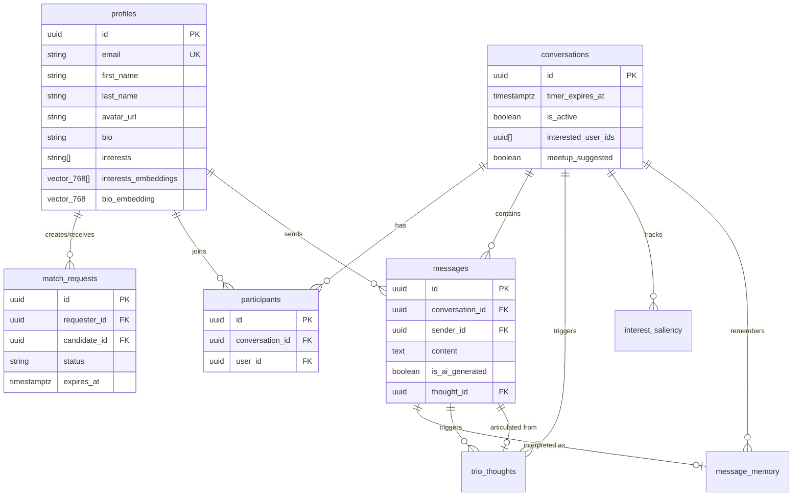

# Data Models Overview

Complete reference for all database tables, relationships, and cognitive AI system architecture.

---

## Table of Contents

1. [Core Tables](#core-tables)
2. [Cognitive AI Tables](#cognitive-ai-tables)
3. [Table Relationships](#table-relationships)
4. [Entity-Relationship Diagram](#entity-relationship-diagram)
5. [Cognitive System Architecture](#cognitive-system-architecture)
6. [Generating Database Diagrams](#generating-database-diagrams)

---

## Core Tables

| Table            | Purpose                                   | Documentation                          |
| ---------------- | ----------------------------------------- | -------------------------------------- |
| `profiles`       | User identity, interests, bio, embeddings | [profile.md](./profile.md)             |
| `match_requests` | Matchmaking state machine                 | [match-request.md](./match-request.md) |
| `conversations`  | 1:1 chat sessions with timer              | [conversation.md](./conversation.md)   |
| `participants`   | Links users to conversations              | [participant.md](./participant.md)     |
| `messages`       | Chat messages (user + AI)                 | [message.md](./message.md)             |

---

## Cognitive AI Tables

| Table               | Purpose                                           | Documentation                                  |
| ------------------- | ------------------------------------------------- | ---------------------------------------------- |
| `trio_thoughts`     | All thoughts Trio generates (System 1 + System 2) | [trio-thought.md](./trio-thought.md)           |
| `thought_stimuli`   | Tracks inputs that inspired each thought          | [thought-stimulus.md](./thought-stimulus.md)   |
| `interest_saliency` | Dynamic relevance scores for interests            | [interest-saliency.md](./interest-saliency.md) |
| `message_memory`    | Short-term memory with interpretations            | [message-memory.md](./message-memory.md)       |

---

## Table Relationships

### Core System

```
profiles (users)
    ├─→ match_requests (requester_id, candidate_id)
    ├─→ participants (user_id)
    ├─→ messages (sender_id)
    └─→ interest_saliency (user_id)

conversations
    ├─→ participants (conversation_id) [exactly 2]
    ├─→ messages (conversation_id)
    ├─→ trio_thoughts (conversation_id)
    ├─→ interest_saliency (conversation_id)
    └─→ message_memory (conversation_id)

messages
    ├─→ trio_thoughts (trigger_message_id) [if message triggered thoughts]
    ├─→ message_memory (message_id) [1:1]
    └─→ trio_thoughts (articulated_message_id) [if Trio message]
```

### Cognitive System

```
trio_thoughts
    ├─→ thought_stimuli (thought_id) [2-5 stimuli for System 2]
    └─→ messages (articulated_message_id) [if selected]

thought_stimuli
    ├─→ interest_saliency (stimulus_ref_id) [if type = 'interest']
    ├─→ message_memory (stimulus_ref_id) [if type = 'message']
    ├─→ trio_thoughts (stimulus_ref_id) [if type = 'previous_thought']
    └─→ profiles (stimulus_ref_id) [if type = 'profile_bio']

message_memory
    └─→ messages (message_id) [1:1]

interest_saliency
    ├─→ conversations (conversation_id)
    └─→ profiles (user_id)
```

---

## Entity-Relationship Diagram

### Core Tables



### Cognitive AI Tables

```mermaid
erDiagram
    trio_thoughts ||--o{ thought_stimuli : "inspired by"
    trio_thoughts ||--o| messages : "becomes"

    thought_stimuli }o--|| interest_saliency : "references"
    thought_stimuli }o--|| message_memory : "references"
    thought_stimuli }o--|| trio_thoughts : "references"
    thought_stimuli }o--|| profiles : "references"

    message_memory ||--|| messages : "interprets"

    interest_saliency }o--|| conversations : "scoped to"
    interest_saliency }o--|| profiles : "belongs to"

    trio_thoughts {
        uuid id PK
        uuid conversation_id FK
        uuid trigger_message_id FK
        system_type system_type
        string category
        text content
        decimal motivation_score
        boolean was_selected
        uuid articulated_message_id FK
    }

    thought_stimuli {
        uuid id PK
        uuid thought_id FK
        stimulus_type stimulus_type
        uuid stimulus_ref_id
        text stimulus_text
        decimal saliency_score
    }

    interest_saliency {
        uuid id PK
        uuid conversation_id FK
        uuid user_id FK
        text interest_text UK
        decimal saliency_score
        vector_768 embedding
    }

    message_memory {
        uuid id PK
        uuid conversation_id FK
        uuid message_id FK_UK
        text interpretation
        decimal saliency_score
        vector_768 embedding
    }
```

---

## Cognitive System Architecture

**See [AI Interjections](../features/ai-interjections.md) for full 8-phase workflow details.**

**Summary:** New message → Update saliency → Add to memory → Generate thoughts (System 1 + System 2) → Evaluate → Select if score >= 3.5 → Articulate → Post message

---

## Generating Database Diagrams

The diagrams above use [Mermaid](https://mermaid.js.org/), which renders automatically in GitHub, GitLab, VS Code, and many documentation tools. **No setup required** - diagrams render directly in markdown viewers.

For interactive diagrams, use [dbdiagram.io](https://dbdiagram.io/) with DBML export.

---

## Key Concepts

### Embedding Vectors

- **Dimension:** 768 (Gemini embedding model output)
- **Purpose:** Semantic similarity search via cosine distance
- **Index:** IVFFlat (approximate nearest neighbor)
- **Tables:** `profiles`, `interest_saliency`, `message_memory`

### Saliency Scores

- **Range:** 0.0 to 2.0+ (typically 0.0-1.5)
- **Decay Factors:**
  - Interests: 0.99 (slow - stable traits)
  - Messages: 0.95 (fast - ephemeral context)
- **Update:** Every new message in conversation

### Thought System Types

- **System 1:** Fast, intuitive (1 thought per trigger, no stimuli)
- **System 2:** Deliberate, memory-based (2 thoughts per trigger, 2-5 stimuli)

### RLS (Row Level Security)

All tables enforce participant-only access via RLS policies. Admin client bypasses RLS for Trio system messages.

---

## See Also

- [AI Interjections](../features/ai-interjections.md) - Full cognitive workflow specification
- [Supabase Patterns](../infrastructure/supabase-patterns.md) - Database access patterns
- [AI Integration](../infrastructure/ai-integration.md) - Gemini API patterns
