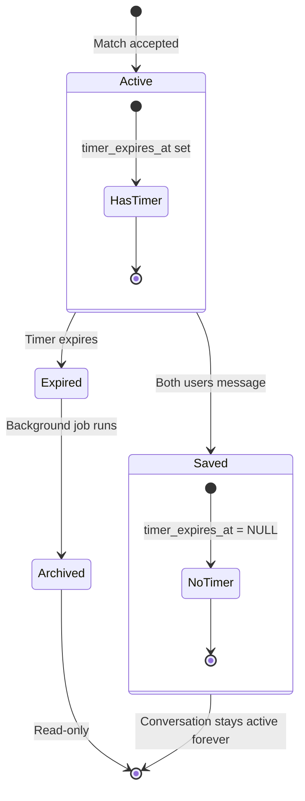

# Conversation Data Model

## Purpose
Represents a 1:1 chat session between two matched users with timer and metadata.

## Scope
- **In scope:** Schema, fields, timer logic, archiving
- **Out of scope:** Message CRUD (see [Message](./message.md)), real-time subscriptions (see [Supabase Patterns](../infrastructure/supabase-patterns.md))

## Dependencies
- [Glossary](../shared/glossary.md) for domain terms
- [Timer System](../features/timer-system.md) for timer behavior

---

## Schema

### Table: `conversations`

| Field | Type | Constraints | Description |
|-------|------|-------------|-------------|
| `id` | UUID | PK | Conversation ID |
| `created_at` | timestamptz | NOT NULL, default now() | Creation timestamp |
| `is_active` | boolean | NOT NULL, default true | Active (true) or archived (false) |
| `timer_expires_at` | timestamptz | nullable | 24h timer deadline. NULL = saved (both users messaged) |
| `last_message_sender_id` | UUID | FK to auth.users, nullable | User who sent most recent message |
| `interested_user_ids` | UUID[] | default `{}` | Users who clicked "interested" button (☕) |
| `meetup_suggested` | boolean | default false | True if meetup suggestion already sent |
| `meetup_trigger_after` | int | nullable | (Legacy) Message count threshold for meetup |
| `user_ids_who_messaged` | UUID[] | default `{}` | Users who have sent at least one message |

### Indexes
```sql
CREATE INDEX idx_conversations_active ON conversations(is_active);
CREATE INDEX idx_conversations_timer ON conversations(timer_expires_at)
  WHERE timer_expires_at IS NOT NULL;
```

### RLS Policies
```sql
-- Users can view conversations they're part of
CREATE POLICY "Users can view own conversations"
  ON conversations FOR SELECT
  USING (
    EXISTS (
      SELECT 1 FROM participants
      WHERE participants.conversation_id = conversations.id
      AND participants.user_id = auth.uid()
    )
  );
```

---

## Field Details

### Timer Fields
- **timer_expires_at:** Set to `now() + 24 hours` on creation. Cleared (set to NULL) when both users message.
- **user_ids_who_messaged:** Tracks who has sent at least one message. When length = 2, timer clears.

### State Fields
- **is_active:**
  - `true`: Conversation active, can receive messages
  - `false`: Conversation archived (timer expired), read-only

### Meetup Fields
- **interested_user_ids:** Double-blind interest tracking. Neither user sees other's status until both click.
- **meetup_suggested:** Flag to prevent duplicate meetup suggestions.
- **meetup_trigger_after:** Legacy field (unused). Original design: trigger meetup after N messages. Current: trigger when both interested.

---

## Business Rules

1. **Creation:** Conversation created when match is accepted with:
   - `is_active = true`
   - `timer_expires_at = now() + 24 hours`
   - `user_ids_who_messaged = []`

2. **Timer Clearing:** When user sends message, add to `user_ids_who_messaged`. If all participants present, set `timer_expires_at = NULL`.

3. **Archiving:** Background job sets `is_active = false` when `timer_expires_at < now()`.

4. **Participants:** Exactly 2 users (enforced via [Participant](./participant.md) table).

5. **Meetup Trigger:** When `interested_user_ids.length >= 2` AND `meetup_suggested = false`, generate meetup suggestion.

---

## Lifecycle



---

## Acceptance Criteria

- [ ] Conversation created with 24h timer on match acceptance
- [ ] Timer clears when both participants send a message
- [ ] Archived conversations reject new messages (checked in sendMessage)
- [ ] interested_user_ids supports double-blind interest tracking
- [ ] RLS enforces participant-only access
