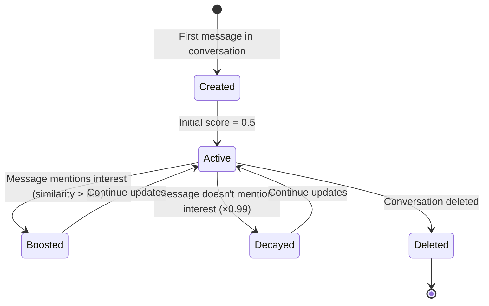

# Interest Saliency Data Model

## Purpose
Tracks dynamic relevance scores for user interests based on conversation context. Core of Phase 2 (Saliency Recalibration) in cognitive workflow.

## Scope
- **In scope:** Schema, saliency updates, decay factors, semantic search
- **Out of scope:** Saliency computation logic (see [ADAPTATION_PLAN.md](../ai_mediator_flow/ADAPTATION_PLAN.md))

## Dependencies
- [Glossary](../shared/glossary.md) for domain terms
- [Conversation](./conversation.md) for scope
- [Profile](./profile.md) for interest source

---

## Schema

### Table: `interest_saliency`

| Field | Type | Constraints | Description |
|-------|------|-------------|-------------|
| `id` | UUID | PK | Saliency record ID |
| `conversation_id` | UUID | FK to conversations(id) ON DELETE CASCADE, NOT NULL | Scoped to this conversation |
| `user_id` | UUID | FK to profiles(id) ON DELETE CASCADE, NOT NULL | Interest owner |
| `interest_text` | text | NOT NULL | Interest string (e.g., "hiking") |
| `saliency_score` | numeric(4,3) | NOT NULL, default 0.5 | Current relevance score (0.0-2.0+) |
| `last_updated_at` | timestamptz | NOT NULL, default now() | Last recalibration timestamp |
| `embedding` | vector(768) | NOT NULL | Semantic embedding of interest text |

### Composite Unique Constraint
```sql
CREATE UNIQUE INDEX idx_interest_saliency_unique
  ON interest_saliency(conversation_id, user_id, interest_text);
```

### Indexes
```sql
CREATE INDEX idx_interest_saliency_conversation ON interest_saliency(conversation_id, saliency_score DESC);
CREATE INDEX idx_interest_saliency_user ON interest_saliency(user_id);
CREATE INDEX idx_interest_saliency_embedding ON interest_saliency
  USING ivfflat (embedding vector_cosine_ops) WITH (lists = 100);
```

### RLS Policies
```sql
-- Users can view interest saliency in their conversations
CREATE POLICY "Users can view interest saliency in own conversations"
  ON interest_saliency FOR SELECT
  USING (
    EXISTS (
      SELECT 1 FROM participants
      WHERE participants.conversation_id = interest_saliency.conversation_id
      AND participants.user_id = auth.uid()
    )
  );
```

---

## Field Details

### Saliency Score
- **Initial value:** 0.5 (neutral relevance)
- **Range:** 0.0 to 2.0+ (unbounded, but typically < 1.5)
- **Update formula:** `new_score = (old_score * decay) + similarity_boost`
  - **decay:** 0.99 (slow decay - interests are stable)
  - **similarity_boost:** Cosine similarity between message embedding and interest embedding
- **Interpretation:**
  - 0.0-0.3: Low relevance (not discussed recently)
  - 0.4-0.7: Moderate relevance
  - 0.8-1.0: High relevance (actively being discussed)
  - 1.0+: Very high relevance (strong recent match)

### Embedding
- **Dimensions:** 768 (Gemini embedding model output)
- **Source:** Copied from `profiles.interests_embeddings[i]` on bootstrap
- **Immutable:** Never updated after creation
- **Purpose:** Enables semantic similarity search with messages

### Conversation Scoping
- **Per-conversation:** Same interest can have different saliency in different conversations
- **Example:** "hiking" has high saliency in Conv A (both users discuss it) but low saliency in Conv B (never mentioned)

---

## Business Rules

1. **Bootstrap (First Message):**
   - When first message sent in conversation, create saliency records for all interests of both users
   - Copy embeddings from `profiles.interests_embeddings`
   - Set initial `saliency_score = 0.5` for all

2. **Update Frequency:**
   - Updated in Phase 2 on EVERY new message in conversation
   - Even if interest not mentioned, score decays by 1% (0.99 factor)

3. **Decay Factor:**
   - **0.99** (slow decay) because interests are stable personality traits
   - Compared to message memory (0.95 decay) which represents ephemeral conversation state

4. **Top-K Selection:**
   - Phase 4 (System 2 generation) retrieves top 5 salient interests
   - Query: `SELECT * FROM interest_saliency WHERE conversation_id = ? ORDER BY saliency_score DESC LIMIT 5`

5. **Uniqueness:**
   - One record per (conversation, user, interest) tuple
   - If user updates profile interests mid-conversation, new saliency records created

---

## Lifecycle



---

## Example Data

**Conversation about hiking:**

User A interests: ["hiking", "photography", "cooking"]
User B interests: ["hiking", "rock climbing", "travel"]

After 10 messages discussing hiking and mentioning "East Rock trail":

```json
[
  {
    "conversation_id": "conv-123",
    "user_id": "user-A",
    "interest_text": "hiking",
    "saliency_score": 1.25,
    "last_updated_at": "2026-03-29T12:10:00Z"
  },
  {
    "conversation_id": "conv-123",
    "user_id": "user-A",
    "interest_text": "photography",
    "saliency_score": 0.45,
    "last_updated_at": "2026-03-29T12:10:00Z"
  },
  {
    "conversation_id": "conv-123",
    "user_id": "user-B",
    "interest_text": "hiking",
    "saliency_score": 1.28,
    "last_updated_at": "2026-03-29T12:10:00Z"
  },
  {
    "conversation_id": "conv-123",
    "user_id": "user-B",
    "interest_text": "rock climbing",
    "saliency_score": 0.78,
    "last_updated_at": "2026-03-29T12:10:00Z"
  }
]
```

**Analysis:** "hiking" highly salient for both users. "rock climbing" moderately salient (semantically related to hiking/outdoor discussion). "photography" and other interests decayed.

---

## Use Cases

### 1. Top Salient Interests for System 2
```sql
SELECT interest_text, saliency_score, user_id
FROM interest_saliency
WHERE conversation_id = ?
ORDER BY saliency_score DESC
LIMIT 5;
```

### 2. Shared Interest Detection
```sql
SELECT
  a.interest_text,
  a.saliency_score AS user_a_saliency,
  b.saliency_score AS user_b_saliency
FROM interest_saliency a
JOIN interest_saliency b
  ON a.conversation_id = b.conversation_id
  AND a.interest_text = b.interest_text
WHERE a.conversation_id = ?
  AND a.user_id = ?  -- User A
  AND b.user_id = ?  -- User B
  AND a.saliency_score > 0.7
  AND b.saliency_score > 0.7
ORDER BY (a.saliency_score + b.saliency_score) DESC;
```

### 3. Interest Trend Analysis
```sql
SELECT
  interest_text,
  COUNT(DISTINCT conversation_id) AS conversation_count,
  AVG(saliency_score) AS avg_saliency
FROM interest_saliency
WHERE saliency_score > 0.8
GROUP BY interest_text
ORDER BY conversation_count DESC
LIMIT 20;
```

---

## Performance Considerations

### Vector Index (IVFFlat)
- **lists = 100:** Good for ~10,000-100,000 records
- **Query:** `ORDER BY embedding <=> query_embedding LIMIT 5` (cosine similarity)
- **Trade-off:** Approximate nearest neighbor (fast) vs exact (slow)

### Update Batching
- Phase 2 updates all interests in conversation (typically 10-20 records)
- Single transaction per message to ensure consistency
- Embedding similarity computed in application layer (not DB)

---

## Acceptance Criteria

- [ ] Bootstrap creates saliency records for all user interests on first message
- [ ] Embeddings copied from `profiles.interests_embeddings` on creation
- [ ] Saliency scores update on every message with 0.99 decay factor
- [ ] Unique constraint enforces one record per (conversation, user, interest)
- [ ] Top 5 salient interests retrievable via sorted query
- [ ] Vector index enables efficient semantic similarity search
- [ ] RLS prevents viewing saliency from other conversations
- [ ] Cascade delete when conversation deleted
