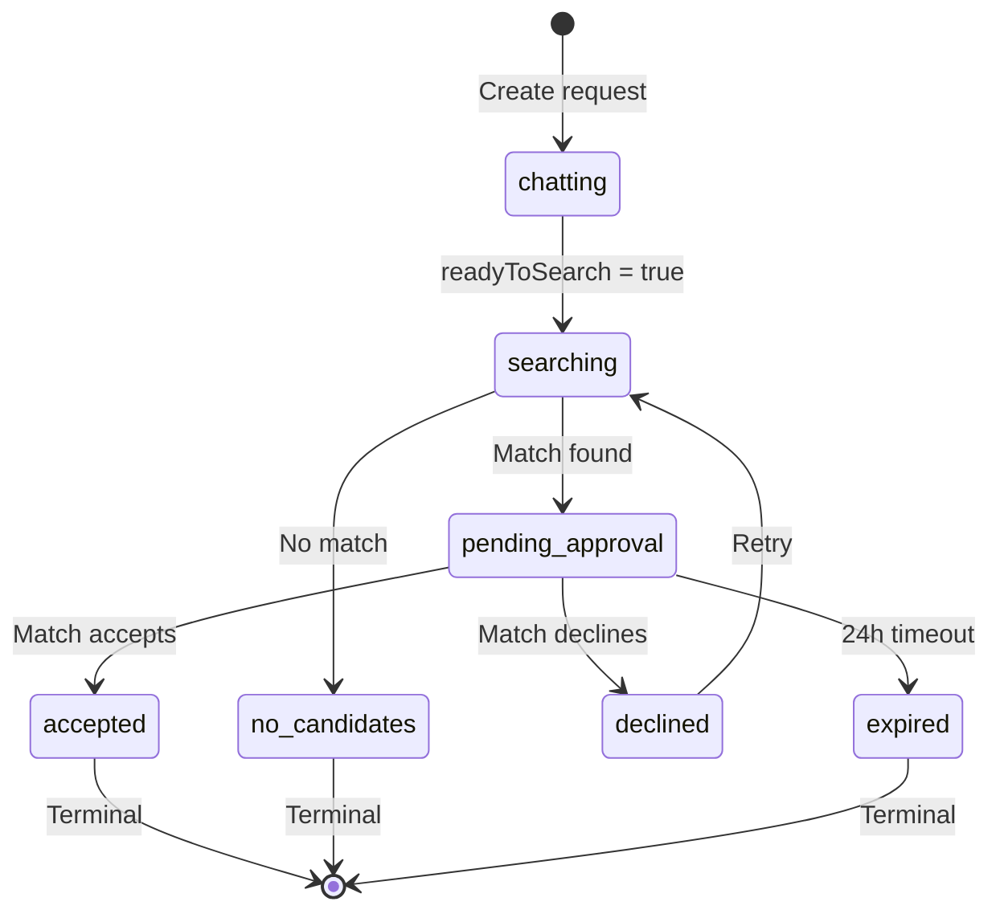

# Match Request Data Model

## Purpose
State machine representing a user's search for a match. Stores conversation history with Kintsu AI.

## Scope
- **In scope:** Schema, state machine, conversation history storage
- **Out of scope:** Matchmaking logic (see [Matchmaking Flow](../features/matchmaking-flow.md))

## Dependencies
- [Glossary](../shared/glossary.md) for state definitions
- [Matchmaking Flow](../features/matchmaking-flow.md) for state transitions

---

## Schema

### Table: `match_requests`

| Field | Type | Constraints | Description |
|-------|------|-------------|-------------|
| `id` | UUID | PK | Match request ID |
| `requester_id` | UUID | FK to auth.users(id) ON DELETE CASCADE, NOT NULL | User searching for match |
| `status` | text | NOT NULL, default 'chatting', CHECK constraint | State machine status |
| `matched_user_id` | UUID | FK to auth.users(id) ON DELETE SET NULL, nullable | Proposed match (if pending) |
| `declined_user_ids` | UUID[] | default `{}` | Users who were proposed but declined |
| `conversation_history` | jsonb | default `[]` | Array of {role, content} with Kintsu |
| `match_reason` | text | nullable | 3 bullet points explaining match |
| `intro_message` | text | nullable | AI-generated intro message for chat |
| `conversation_id` | UUID | FK to conversations(id) ON DELETE SET NULL, nullable | Created conversation (if accepted) |
| `created_at` | timestamptz | NOT NULL, default now() | Request creation time |
| `updated_at` | timestamptz | NOT NULL, default now() | Last update time |
| `expires_at` | timestamptz | NOT NULL, default now() + 24h | Expiration deadline |

### Status Values
```sql
CHECK (status IN (
  'chatting',           -- Kintsu asking questions
  'searching',          -- AI evaluating candidates
  'pending_approval',   -- Awaiting matched user response
  'accepted',           -- Match accepted (terminal)
  'declined',           -- Match declined (retry)
  'expired',            -- Timeout (terminal)
  'no_candidates',      -- No suitable matches (terminal)
  'error'               -- Error occurred, user can retry (terminal)
))
```

### Error Handling Fields
| Field | Type | Description |
|-------|------|-------------|
| `error_message` | text | User-friendly error message when status = 'error' |

Error state is set when:
- `findMatch()` fails (database errors, AI errors, invalid candidates)
- Request stuck in `searching` state for > 5 minutes (timeout detection)

Users can clear error state and retry via `clearMatchRequestError()` action.

### Indexes
```sql
CREATE INDEX idx_match_requests_requester ON match_requests(requester_id, status);
CREATE INDEX idx_match_requests_matched ON match_requests(matched_user_id, status);
```

### Auto-update Trigger
```sql
CREATE TRIGGER match_requests_updated_at
  BEFORE UPDATE ON match_requests
  FOR EACH ROW
  EXECUTE FUNCTION update_match_request_timestamp();
```

### RLS Policies
```sql
-- Requester can view own requests
CREATE POLICY "Users can view own match requests"
  ON match_requests FOR SELECT
  USING (auth.uid() = requester_id);

-- Matched user can view pending requests
CREATE POLICY "Matched users can view pending requests"
  ON match_requests FOR SELECT
  USING (auth.uid() = matched_user_id AND status = 'pending_approval');

-- Requester can update own chatting/searching requests
CREATE POLICY "Requester can update own requests"
  ON match_requests FOR UPDATE
  USING (auth.uid() = requester_id AND status IN ('chatting', 'searching'));

-- Matched user can respond to pending requests
CREATE POLICY "Matched user can respond to pending"
  ON match_requests FOR UPDATE
  USING (auth.uid() = matched_user_id AND status = 'pending_approval');
```

---

## Field Details

### State Fields
- **status:** Current state in matchmaking flow. See [Matchmaking Flow](../features/matchmaking-flow.md) for state diagram.

- **requester_id:** User who initiated match request (the one looking for a match).

- **matched_user_id:** User selected by AI as potential match. Set during `searching` → `pending_approval` transition. Cleared on `declined` (retry).

### Conversation History
```typescript
conversation_history: Array<{
  role: 'user' | 'model'
  content: string
}>
```

Example:
```json
[
  {"role": "user", "content": "I want to meet someone into hiking"},
  {"role": "model", "content": "What kind of hiking do you enjoy?"},
  {"role": "user", "content": "I love bouldering and trail running"}
]
```

- **Max length:** 3 exchanges (user → model → user → model → user → model)
- **Used for:** AI matchmaking context (passed to Gemini when selecting candidate)

### Match Metadata
- **match_reason:** 3 bullet points (max 8 words each). Example:
  ```
  • Both obsessed with sourdough
  • You're the climbing partner they need
  • Shared love of late-night philosophy
  ```

- **intro_message:** AI-generated warm introduction message addressing both matched users. Generated during `searching` phase by Gemini and posted to the conversation when match is accepted. Example:
  ```
  "You two share a love for bouldering and late-night philosophy — I think you'll really vibe!"
  ```

- **declined_user_ids:** Accumulates rejected matches. Used to exclude from future candidate pools. Reset only when new request created.

- **conversation_id:** Set when match accepted. Links to created conversation.

### Expiration
- **expires_at:** 24 hours from creation. Auto-expired by `getActiveMatchRequest()` before querying.

---

## State Machine



---

## Business Rules

1. **Creation:** New request starts in `chatting` with empty `conversation_history`.

2. **Chatting Phase:** Max 3 AI replies. After 3rd reply, force `readyToSearch = true`.

3. **Searching Phase:** AI evaluates candidates. Excludes:
   - `requester_id` (self)
   - Existing conversation partners
   - `declined_user_ids`

4. **Pending Approval:** Matched user has 24h to respond. Auto-expires via background check.

5. **Decline Handling:** Add `matched_user_id` to `declined_user_ids`, clear `matched_user_id` and `match_reason`, return to `searching`.

6. **Acceptance:** Create conversation, set `conversation_id`, status = `accepted`.

7. **Terminal States:** `accepted`, `expired`, `no_candidates` — no further transitions.

---

## Acceptance Criteria

- [ ] Match request created with status = 'chatting'
- [ ] conversation_history stores Kintsu dialogue (max 6 messages)
- [ ] declined_user_ids prevents re-matching with declined users
- [ ] Auto-expires requests older than 24h when queried
- [ ] RLS allows requester and matched_user access only
- [ ] State machine enforces valid transitions (no skipping states)
