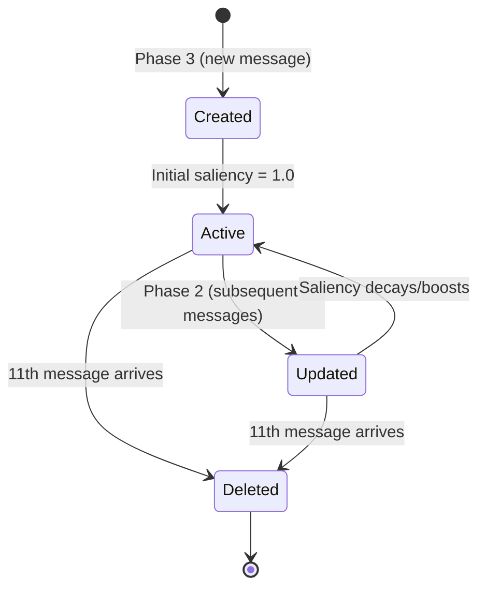

# Message Memory Data Model

## Purpose
Short-term memory buffer of recent messages with semantic interpretations. Core of Phase 3 (Memory Addition) and context for System 2 thought generation.

## Scope
- **In scope:** Schema, rolling window, interpretation storage, saliency updates
- **Out of scope:** Interpretation generation logic (see [ADAPTATION_PLAN.md](../ai_mediator_flow/ADAPTATION_PLAN.md))

## Dependencies
- [Glossary](../shared/glossary.md) for domain terms
- [Message](./message.md) for source entity
- [Conversation](./conversation.md) for scope

---

## Schema

### Table: `message_memory`

| Field | Type | Constraints | Description |
|-------|------|-------------|-------------|
| `id` | UUID | PK | Memory record ID |
| `conversation_id` | UUID | FK to conversations(id) ON DELETE CASCADE, NOT NULL | Parent conversation |
| `message_id` | UUID | FK to messages(id) ON DELETE CASCADE, NOT NULL, UNIQUE | Original message |
| `interpretation` | text | NOT NULL | LLM-generated semantic interpretation |
| `saliency_score` | numeric(4,3) | NOT NULL, default 1.0 | Current relevance score |
| `embedding` | vector(768) | NOT NULL | Semantic embedding of content + interpretation |
| `last_updated_at` | timestamptz | NOT NULL, default now() | Last recalibration timestamp |

### Indexes
```sql
CREATE INDEX idx_message_memory_conversation ON message_memory(conversation_id, last_updated_at DESC);
CREATE INDEX idx_message_memory_message ON message_memory(message_id);
CREATE INDEX idx_message_memory_embedding ON message_memory
  USING ivfflat (embedding vector_cosine_ops) WITH (lists = 100);
```

### RLS Policies
```sql
-- Users can view message memory from their conversations
CREATE POLICY "Users can view message memory in own conversations"
  ON message_memory FOR SELECT
  USING (
    EXISTS (
      SELECT 1 FROM participants
      WHERE participants.conversation_id = message_memory.conversation_id
      AND participants.user_id = auth.uid()
    )
  );
```

---

## Field Details

### Interpretation
- **Purpose:** Extracts deeper meaning beyond literal text
- **Generated by:** LLM (Phase 3) analyzing message in conversation context
- **Content includes:**
  - Emotional tone (enthusiastic, hesitant, awkward)
  - Connection signals (showing interest, asking questions)
  - Friction points (confusion, disagreement, topic mismatch)
  - Interest mentions (explicit or implicit references to hobbies/activities)

**Example:**
- **Message:** "I've been to East Rock a few times, it's pretty nice"
- **Interpretation:** "User A expressing positive familiarity with outdoor activity; casual tone; indirect agreement with User B's earlier hiking mention; potential connection opportunity"

### Saliency Score
- **Initial value:** 1.0 (maximally relevant - brand new message)
- **Range:** 0.0 to 2.0+ (typically decays to 0.2-0.5 after 10+ messages)
- **Update formula:** `new_score = (old_score * decay) + similarity_boost`
  - **decay:** 0.95 (faster decay than interests - messages are ephemeral)
  - **similarity_boost:** Cosine similarity with new message embedding
- **Purpose:** Recent messages more relevant than old ones

### Embedding
- **Dimensions:** 768 (Gemini embedding model)
- **Source:** Combined embedding of message content + interpretation
- **Created:** Phase 3 (Memory Addition) when message first added
- **Updated:** Never (immutable after creation)
- **Purpose:** Semantic similarity search in Phase 2 and Phase 4

### Rolling Window
- **Size:** Last 10 messages per conversation
- **Retention policy:** When 11th message arrives, delete oldest message memory
- **Query:** `DELETE FROM message_memory WHERE id = (SELECT id FROM message_memory WHERE conversation_id = ? ORDER BY last_updated_at ASC LIMIT 1)`

---

## Business Rules

1. **Creation (Phase 3):**
   - Every new message creates a memory record
   - Interpretation generated via LLM call
   - Initial saliency = 1.0 (most recent = most relevant)

2. **Rolling Window:**
   - Maintain exactly last 10 messages per conversation
   - Delete oldest when adding 11th
   - Applies to all messages (user AND Trio messages)

3. **Saliency Updates (Phase 2):**
   - Updated on EVERY new message in conversation
   - Decay factor: 0.95 (faster than interests because conversation context shifts quickly)
   - Messages semantically similar to new message get boosted

4. **System 1 vs System 2:**
   - **System 1:** Uses last 3 messages only
   - **System 2:** Uses last 5 messages only
   - Retrieved by: `SELECT * FROM message_memory WHERE conversation_id = ? ORDER BY last_updated_at DESC LIMIT N`

5. **Immutability:**
   - Interpretation and embedding never change after creation
   - Only saliency_score and last_updated_at updated

---

## Lifecycle



---

## Example Data

**Conversation with 10 messages (most recent first):**

```json
[
  {
    "message_id": "msg-010",
    "interpretation": "User B enthusiastic about hiking suggestion; asking specific questions about trail difficulty",
    "saliency_score": 1.0,
    "last_updated_at": "2026-03-29T12:10:00Z"
  },
  {
    "message_id": "msg-009",
    "interpretation": "User A proposing East Rock trail; confident tone; building on earlier outdoor interest",
    "saliency_score": 0.92,
    "last_updated_at": "2026-03-29T12:09:00Z"
  },
  {
    "message_id": "msg-008",
    "interpretation": "Trio interjection highlighting shared hiking interest; encouraging connection",
    "saliency_score": 0.85,
    "last_updated_at": "2026-03-29T12:08:00Z"
  },
  {
    "message_id": "msg-007",
    "interpretation": "User B mentioning love of outdoor activities; indirect interest signal",
    "saliency_score": 0.78,
    "last_updated_at": "2026-03-29T12:07:00Z"
  },
  {
    "message_id": "msg-006",
    "interpretation": "User A discussing photography; casual tone; not directly connected to hiking yet",
    "saliency_score": 0.32,
    "last_updated_at": "2026-03-29T12:06:00Z"
  }
]
```

**Note:** Messages 6-10 highly salient (recent conversation about hiking). Earlier messages decayed to 0.3-0.5 (less relevant).

---

## Use Cases

### 1. Retrieve Recent Context for System 1
```sql
SELECT m.content, mm.interpretation, mm.saliency_score
FROM message_memory mm
JOIN messages m ON m.id = mm.message_id
WHERE mm.conversation_id = ?
ORDER BY mm.last_updated_at DESC
LIMIT 3;
```

### 2. Retrieve Recent Context for System 2
```sql
SELECT m.content, mm.interpretation, mm.saliency_score
FROM message_memory mm
JOIN messages m ON m.id = mm.message_id
WHERE mm.conversation_id = ?
ORDER BY mm.last_updated_at DESC
LIMIT 5;
```

### 3. Semantic Search for Similar Messages
```sql
SELECT mm.interpretation, mm.saliency_score,
  (mm.embedding <=> ?::vector) AS similarity
FROM message_memory mm
WHERE mm.conversation_id = ?
ORDER BY similarity ASC
LIMIT 5;
```

### 4. Maintain Rolling Window (Delete Oldest)
```sql
DELETE FROM message_memory
WHERE id = (
  SELECT id FROM message_memory
  WHERE conversation_id = ?
  ORDER BY last_updated_at ASC
  LIMIT 1
);
```

---

## Performance Considerations

### Storage
- **10 messages × 10,000 conversations = 100,000 records**
- **Each record:** ~4 KB (interpretation + embedding)
- **Total:** ~400 MB base + ~800 MB indexes = 1.2 GB

### Update Frequency
- Phase 2 updates all memory records in conversation (typically 10 records)
- Phase 3 inserts 1 new record and deletes 1 old (if > 10)
- Transaction ensures consistency

### Vector Search
- IVFFlat index with lists=100 good for ~100,000 records
- Approximate search acceptable (trade-off: speed vs accuracy)

---

## Acceptance Criteria

- [ ] Every new message creates a memory record with interpretation
- [ ] Initial saliency score = 1.0 for all new messages
- [ ] Rolling window maintains exactly last 10 messages per conversation
- [ ] Oldest message deleted when 11th arrives
- [ ] Saliency scores update on every message with 0.95 decay factor
- [ ] Embedding captures both content and interpretation semantics
- [ ] System 1 retrieves last 3, System 2 retrieves last 5 messages
- [ ] RLS prevents viewing memory from other conversations
- [ ] Cascade delete when conversation or message deleted
