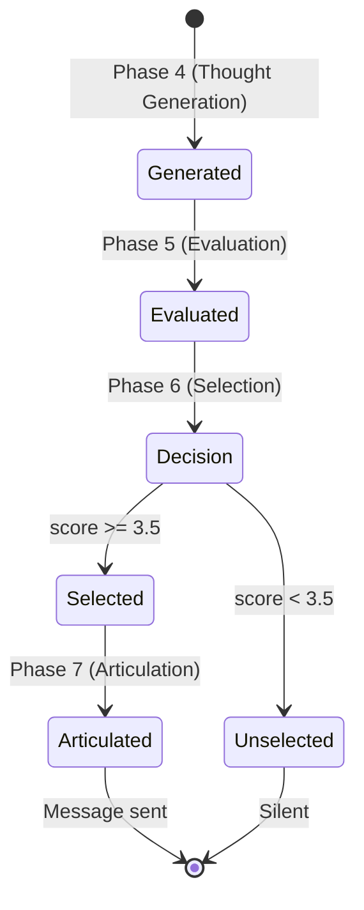

# Trio Thought Data Model

## Purpose
Stores all thoughts Trio generates during cognitive workflow (selected and unselected). Core entity for dual-process AI interjection system.

## Scope
- **In scope:** Schema, thought types, evaluation scores, selection logic
- **Out of scope:** Thought generation logic (see [AI Interjections](../features/ai-interjections.md)), articulation (see [Chat Actions](../api/chat-actions.md))

## Dependencies
- [Glossary](../shared/glossary.md) for domain terms
- [ADAPTATION_PLAN.md](../ai_mediator_flow/ADAPTATION_PLAN.md) for cognitive framework
- [Conversation](./conversation.md) for parent entity
- [Message](./message.md) for trigger and articulation

---

## Schema

### Table: `trio_thoughts`

| Field | Type | Constraints | Description |
|-------|------|-------------|-------------|
| `id` | UUID | PK | Thought ID |
| `conversation_id` | UUID | FK to conversations(id) ON DELETE CASCADE, NOT NULL | Parent conversation |
| `trigger_message_id` | UUID | FK to messages(id) ON DELETE CASCADE, NOT NULL | Message that triggered this thought |
| `system_type` | enum | NOT NULL, CHECK IN ('system1', 'system2') | Which cognitive process generated this |
| `category` | text | NOT NULL | shared_interest, friction_reduction, meetup_nudge, icebreaker, encouragement, connection |
| `content` | text | NOT NULL | Internal thought text (not user-facing) |
| `motivation_score` | numeric(3,2) | NOT NULL, CHECK >= 1.0 AND <= 5.0 | Final score after balance penalty |
| `base_score` | numeric(3,2) | NOT NULL | Pre-penalty evaluation score |
| `evaluation_reasoning` | text | nullable | LLM's reasoning for the score |
| `was_selected` | boolean | NOT NULL, default false | True if this thought was articulated and sent |
| `articulated_message_id` | UUID | FK to messages(id) ON DELETE SET NULL, nullable | If selected, the message ID it became |
| `created_at` | timestamptz | NOT NULL, default now() | Timestamp |

### Indexes
```sql
CREATE INDEX idx_trio_thoughts_conversation ON trio_thoughts(conversation_id, created_at DESC);
CREATE INDEX idx_trio_thoughts_selected ON trio_thoughts(was_selected) WHERE was_selected = true;
CREATE INDEX idx_trio_thoughts_trigger ON trio_thoughts(trigger_message_id);
```

### RLS Policies
```sql
-- Users can view thoughts from their conversations
CREATE POLICY "Users can view thoughts in own conversations"
  ON trio_thoughts FOR SELECT
  USING (
    EXISTS (
      SELECT 1 FROM participants
      WHERE participants.conversation_id = trio_thoughts.conversation_id
      AND participants.user_id = auth.uid()
    )
  );
```

---

## Field Details

### System Types
- **system1:** Fast, intuitive reactions (1 thought per trigger)
  - Based on last 3 messages only
  - Temperature: 0.8 (high spontaneity)
  - Brief (< 15 words)
  - Categories: encouragement, connection, friction_reduction

- **system2:** Deliberate, memory-based (2 thoughts per trigger)
  - Based on last 5 messages + top 5 salient interests + top 3 thoughts
  - Temperature: 0.5 (balanced)
  - Cites stimuli (tracked in `thought_stimuli` table)
  - Categories: shared_interest, friction_reduction, meetup_nudge, icebreaker

### Thought Categories
- **shared_interest:** Highlights common interests from profiles
- **friction_reduction:** Addresses awkwardness or conversation lulls
- **meetup_nudge:** Suggests offline meetup at relevant venue
- **icebreaker:** Provides conversation starters
- **encouragement:** Positive reinforcement ("You two should totally do that!")
- **connection:** Points out connection opportunities

### Evaluation Fields
- **motivation_score:** Final score (1.0-5.0) determining whether thought is expressed
  - >= 3.5: Selected for articulation
  - < 3.5: Stored but not sent
  - Includes balance penalty (30% reduction if Trio spoke < 3 messages ago)

- **base_score:** Pre-penalty score from LLM evaluation on 5 factors:
  1. Connection Relevance (a): Links to both users' profiles
  2. Friction Severity (b): Addresses social awkwardness
  3. Timing Urgency (c): Right moment to speak
  4. Conversation Coherence (d): Fits natural flow
  5. Interjection Balance (e): Not speaking too frequently

- **evaluation_reasoning:** LLM's explanation citing specific factors

### Selection Fields
- **was_selected:** Only one thought per trigger can be true
- **articulated_message_id:** Links to `messages` table. NULL if not selected.

---

## Business Rules

1. **Thought Generation:**
   - Each trigger creates exactly 3 thoughts: 1 System 1 + 2 System 2
   - System 2 thoughts have entries in `thought_stimuli` table
   - System 1 thoughts have no stimuli (intuitive)

2. **Evaluation:**
   - All 3 thoughts evaluated in parallel
   - Balance penalty applied if `last_message_sender_id` in conversation was Trio within last 3 messages
   - Final score clamped to 1.0-5.0 range

3. **Selection:**
   - Sort by `motivation_score` DESC
   - If top score >= 3.5: mark `was_selected = true`, proceed to articulation
   - If top score < 3.5: all thoughts remain unselected, Trio stays silent

4. **Articulation:**
   - Selected thought converted to Trio-voiced message
   - Message inserted with `thought_id` pointing back to this thought
   - This thought's `articulated_message_id` updated to point to message

5. **Retention:**
   - All thoughts (selected and unselected) stored indefinitely
   - Used for analytics and future saliency updates

---

## Lifecycle



---

## Example Data

**System 1 Thought (Unselected):**
```json
{
  "id": "123e4567-e89b-12d3-a456-426614174000",
  "conversation_id": "conv-456",
  "trigger_message_id": "msg-789",
  "system_type": "system1",
  "category": "encouragement",
  "content": "Both users just mentioned loving hiking - quick positive reinforcement opportunity",
  "motivation_score": 2.8,
  "base_score": 2.8,
  "evaluation_reasoning": "Connection opportunity exists but conversation flowing naturally. Not urgent.",
  "was_selected": false,
  "articulated_message_id": null,
  "created_at": "2026-03-29T12:00:00Z"
}
```

**System 2 Thought (Selected):**
```json
{
  "id": "223e4567-e89b-12d3-a456-426614174001",
  "conversation_id": "conv-456",
  "trigger_message_id": "msg-789",
  "system_type": "system2",
  "category": "shared_interest",
  "content": "User A mentioned East Rock trail, User B has hiking in profile - strong shared interest match",
  "motivation_score": 4.2,
  "base_score": 4.2,
  "evaluation_reasoning": "High connection relevance (both users hikers). Specific venue mentioned. Timely. Fits conversation flow naturally.",
  "was_selected": true,
  "articulated_message_id": "msg-790",
  "created_at": "2026-03-29T12:00:01Z"
}
```

---

## Analytics Queries

**Thought Type Distribution:**
```sql
SELECT system_type, COUNT(*)
FROM trio_thoughts
WHERE was_selected = true
GROUP BY system_type;
```

**Category Breakdown:**
```sql
SELECT category, COUNT(*), AVG(motivation_score)
FROM trio_thoughts
WHERE was_selected = true
GROUP BY category
ORDER BY COUNT(*) DESC;
```

**Selection Rate:**
```sql
SELECT
  COUNT(*) FILTER (WHERE was_selected) * 100.0 / COUNT(*) AS selection_rate_pct
FROM trio_thoughts;
```

**Average Score by System Type:**
```sql
SELECT system_type, AVG(motivation_score), AVG(base_score)
FROM trio_thoughts
GROUP BY system_type;
```

---

## Acceptance Criteria

- [ ] Each trigger creates exactly 3 thoughts (1 System 1 + 2 System 2)
- [ ] Only one thought per trigger can have `was_selected = true`
- [ ] Selected thoughts link to articulated message via `articulated_message_id`
- [ ] Unselected thoughts stored with `was_selected = false` for analytics
- [ ] Motivation score always between 1.0 and 5.0 (enforced by constraint)
- [ ] RLS prevents users from viewing thoughts in other conversations
- [ ] System 2 thoughts have stimuli records in `thought_stimuli` table
