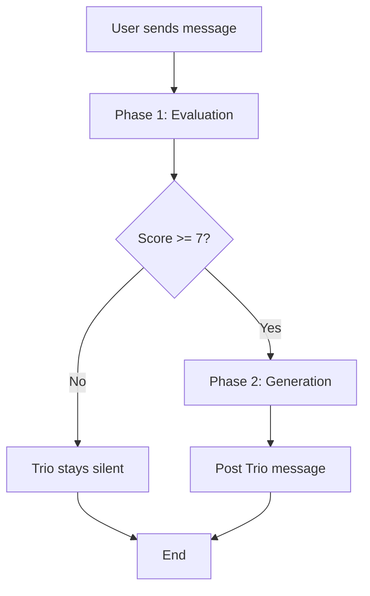

# AI Interjections (Trio)

## Purpose
Context-aware AI interjections where Trio persona monitors conversations and speaks when opportunity score >= 7.

## Scope
- **In scope:** Two-phase evaluation + generation, scoring logic, Trio persona
- **Out of scope:** Message delivery (see [Chat Messaging](./chat-messaging.md)), AI infrastructure (see [AI Integration](../infrastructure/ai-integration.md))

## Dependencies
- [Glossary](../shared/glossary.md) for Trio definition
- [Message](../data-models/message.md) for data model
- [AI Integration](../infrastructure/ai-integration.md) for Gemini patterns

---

## Two-Phase Approach



### Why Two Phases?

1. **Cost Optimization:** Evaluation is fast/cheap, generation is slower/expensive
2. **Precision:** Separate scoring from response generation
3. **Debugging:** Can tune threshold independently

---

## Phase 1: Evaluation

### Purpose
Score conversation (0-10) to determine if Trio should speak.

### evaluateConversationState() Flow

1. **Fetch Last 3 Messages:**
   ```sql
   SELECT content, sender_id, is_ai_generated
   FROM messages
   WHERE conversation_id = ?
   ORDER BY created_at DESC
   LIMIT 3
   ```
   Reverse to chronological order.

2. **Safety Check:**
   ```typescript
   if (messages[messages.length - 1].is_ai_generated) {
     return false  // Trio never speaks twice in a row
   }
   ```

3. **Build Scoring Prompt:**
   ```
   {SCORING_RUBRIC}

   CONTEXT (Profiles):
   - User A: hiking, cooking
   - User B: bouldering, photography

   CHAT HISTORY:
   User: I'm planning a hike this weekend
   User: Which trail do you recommend?
   User: I'm thinking East Rock

   Return JSON: { "score": number, "reason": string }
   ```

4. **Call Gemini 2.5 Flash:**
   - Model: `gemini-2.5-flash` (speed prioritized)
   - Response format: JSON
   - No retry logic (performance over reliability)

5. **Parse Response:**
   ```typescript
   const result = JSON.parse(text) as { score: number, reason: string }
   console.log('[ai] Trio Judge Result:', result)
   ```

6. **Return Decision:**
   ```typescript
   return result.score >= TRIO_CONFIG.INTERJECTION_THRESHOLD  // 7
   ```

### Scoring Rubric

```
SCORE 8-10 (MUST SPEAK):
- Users discussing topic that matches BOTH profiles
- Users need a nudge ("I don't know what to say...")
- Users DIRECTLY address Trio by name
- Perfect setup for witty connection or roast

SCORE 4-7 (MAYBE):
- Standard conversation flow
- Generic agreement ("Yeah", "Cool")
- One user mentions interest, unclear if other shares it

SCORE 0-3 (SILENCE):
- Short, low-effort replies ("lol", "ok")
- Serious/emotional topics (breakups, sad news)
- Logistics (planning meetup time/place)
- Trio just spoke recently
```

### Threshold
```typescript
// lib/trio-config.ts
export const TRIO_CONFIG = {
  INTERJECTION_THRESHOLD: 7,
  // ...
}
```

---

## Phase 2: Generation

### Purpose
Generate Trio's contextual response based on conversation + profiles.

### generateTrioResponse() Flow

1. **Fetch Last 10 Messages:**
   ```sql
   SELECT * FROM messages
   WHERE conversation_id = ?
   ORDER BY created_at DESC
   LIMIT 10
   ```
   Reverse to chronological order.

2. **Fetch Profiles:**
   ```typescript
   const profiles = await supabase
     .from('profiles')
     .select('id, first_name, interests, bio')
     .in('id', userIds)
   ```

3. **Build Generation Prompt:**
   ```
   {TRIO_SYSTEM_PROMPT}

   USER PROFILES:
   [User: Alice]
   - Bio: "Adventure seeker, loves hiking"
   - Interests: bouldering, photography

   [User: Bob]
   - Bio: "Outdoor enthusiast"
   - Interests: hiking, camping

   CHAT HISTORY:
   Alice: I'm planning a hike this weekend
   Bob: Which trail do you recommend?
   Alice: I'm thinking East Rock

   Respond to the conversation as Trio.
   ```

4. **Call Gemini 2.5 Flash:**
   - Model: `gemini-2.5-flash`
   - Response format: Plain text (not JSON)
   - No structured schema

5. **Post Message via Admin Client:**
   ```typescript
   const adminClient = createSupabaseClient(
     process.env.NEXT_PUBLIC_SUPABASE_URL!,
     process.env.SUPABASE_SERVICE_ROLE_KEY!,
     { auth: { autoRefreshToken: false, persistSession: false } }
   )

   await adminClient.from('messages').insert({
     conversation_id: conversationId,
     sender_id: process.env.NEXT_PUBLIC_TRIO_USER_ID!,
     content: responseText,
     is_ai_generated: true
   })
   ```

### Trio System Prompt

```
You are Trio, a wit-infused, high-energy mutual friend who knows everyone.

YOUR GOAL:
Connect users based on shared interests and nudge them to meet offline.

YOUR PERSONA:
- You are a "Social Catalyst", not a robot helper
- Use casual, punchy language
- Be brief (1-2 sentences max)
- NEVER use sitcom catchphrases ("Legendary", "Suit Up")
- NEVER say "How can I help?" or "As an AI..."
- If users are hitting it off, just add "🔥🔥" or quick hype

HOW TO ACT:
1. Scan profiles for shared interests (Spark Points)
2. If they mention a shared topic, JUMP IN and highlight it
3. If conversation dying, drop fun icebreaker from their bios
```

---

## Integration Point

### Trigger in sendMessage()

```typescript
export async function sendMessage(...) {
  // ... insert message ...

  // Trigger AI evaluation (non-blocking)
  try {
    const profiles = await fetchProfiles(conversationId)
    const shouldSpeak = await evaluateConversationState(conversationId, profiles)
    if (shouldSpeak) {
      await generateTrioResponse(conversationId, profiles)
    }
  } catch (e) {
    console.error('AI trigger error:', e)
    // Do NOT block message success
  }

  return true
}
```

**Key:** AI runs AFTER message saved. Errors don't affect user experience.

---

## Business Rules

1. **Never Twice:** If last message is AI, skip evaluation entirely
2. **Threshold:** Score >= 7 required for interjection
3. **Non-blocking:** AI failures don't block message sending
4. **History Windows:**
   - Evaluation: Last 3 messages
   - Generation: Last 10 messages
5. **Admin Client:** Trio messages posted via service role (bypass RLS)
6. **Profile Context:** Always include both users' interests + bio

---

## Performance

| Aspect | Current | Notes |
|--------|---------|-------|
| Evaluation latency | ~1-2 seconds | Gemini Flash |
| Generation latency | ~2-3 seconds | Gemini Flash |
| Total latency | ~3-5 seconds | User doesn't wait (non-blocking) |
| Interjection rate | ~5-10% of messages | Depends on conversation quality |
| Cost | 2 API calls per interjection | Evaluate + generate |

---

## Error Handling

| Error | Behavior | User Impact |
|-------|----------|-------------|
| Evaluation fails | Return `false`, skip generation | None (silent failure) |
| Generation fails | Log error, return `false` | None (Trio doesn't appear) |
| Trio user ID missing | Throw error | None (caught and logged) |
| Message insert fails | Log error, return `false` | None (interjection skipped) |

---

## Acceptance Criteria

- [ ] Evaluation fetches last 3 messages
- [ ] Evaluation returns false if last message is AI
- [ ] Evaluation scores 0-10 using rubric
- [ ] Score >= 7 triggers generation
- [ ] Generation fetches last 10 messages + profiles
- [ ] Trio messages posted via admin client
- [ ] is_ai_generated = true for all Trio messages
- [ ] sender_id = TRIO_USER_ID for all Trio messages
- [ ] AI errors don't block user messages
- [ ] Trio messages visually distinct in UI (gradient background, italic)
