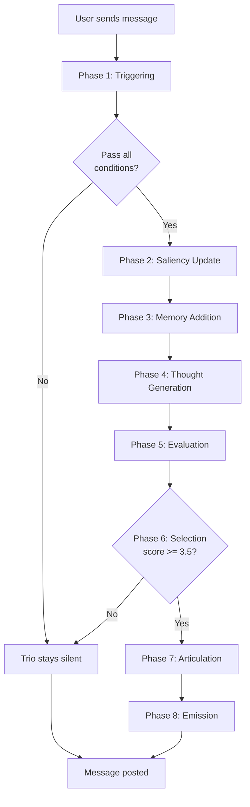

# AI Interjections (Trio Cognitive Workflow)

## Purpose
Sophisticated AI interjection system using dual-process cognition (System 1 + System 2) with saliency-based memory for context-aware, meaningful responses.

## Scope
- **In scope:** 8-phase cognitive workflow, thought generation, saliency engine, memory system
- **Out of scope:** Message delivery (see [Chat Messaging](./chat-messaging.md)), database schemas (see [Data Models](../data-models/README.md))

## Dependencies
- [Glossary](../shared/glossary.md) for Trio definition
- [Trio Thought](../data-models/trio-thought.md) for thought storage
- [Interest Saliency](../data-models/interest-saliency.md) for relevance tracking
- [Message Memory](../data-models/message-memory.md) for short-term memory
- [AI Integration](../infrastructure/ai-integration.md) for Gemini patterns

---

## Cognitive Workflow Overview



**Total Latency:** ~3.5 seconds (non-blocking for user)

---

## Phase 1: Thought Triggering

**Entry:** After user message is inserted into database

**Conditions (ALL must be true):**
1. Message from human user (not Trio)
2. Last message was NOT from Trio (prevent consecutive speaking)
3. Conversation is active (not archived)

**Implementation:** `shouldProcessMessage()` in `app/actions/cognitive-workflow.ts:39`

---

## Phase 2: Saliency Recalibration

**Purpose:** Update relevance scores for all knowledge based on new message

**Process:**
1. Compute semantic embedding of new message (768-dim vector)
2. Update interest saliency:
   - Formula: `new_score = (old_score × 0.99) + cosine_similarity`
   - Decay: 0.99 (slow - interests are stable)
3. Update message memory saliency:
   - Formula: `new_score = (old_score × 0.95) + cosine_similarity`
   - Decay: 0.95 (fast - ephemeral context)

**Implementation:** `updateSaliency()` in `app/actions/cognitive-workflow.ts:89`

**Bootstrap:** On first message, copies interests from profiles to `interest_saliency` table with initial score 0.5

---

## Phase 3: Memory Addition

**Purpose:** Add message to short-term memory with semantic interpretation

**Process:**
1. Generate interpretation via LLM analyzing:
   - Emotional tone (enthusiastic, hesitant, awkward)
   - Connection signals (showing interest, asking questions)
   - Friction points (confusion, disagreement)
   - Interest mentions (explicit or implicit)
2. Create combined embedding (content + interpretation)
3. Insert into `message_memory` table with saliency = 1.0
4. Maintain rolling window (delete oldest if > 10 messages)

**Implementation:** `addToMemory()` in `app/actions/cognitive-workflow.ts:164`

---

## Phase 4: Thought Generation (Dual-Process)

**Purpose:** Generate 3 candidate thoughts (1 System 1 + 2 System 2)

### System 1: Quick Social Reactions
- **Type:** Fast, intuitive
- **Context:** Last 3 messages only
- **Temperature:** 0.8 (high spontaneity)
- **Length:** < 15 words
- **Categories:** encouragement, connection, friction_reduction
- **Stimuli:** None (intuitive)

### System 2: Deliberate Connection-Making
- **Type:** Slow, memory-based
- **Context:**
  - Last 5 messages
  - Top 5 salient interests
  - Top 3 salient previous thoughts
  - User profiles (bio + interests)
- **Temperature:** 0.5 (balanced)
- **Output:** 2 thoughts with stimuli citations
- **Categories:** shared_interest, friction_reduction, meetup_nudge, icebreaker
- **Stimuli:** Each thought cites 2-5 inputs (e.g., "INT#1", "MSG#3")

**Parallelization:** System 1 and System 2 run concurrently

**Implementation:** `generateThoughts()` in `app/actions/cognitive-workflow.ts:402`

---

## Phase 5: Thought Evaluation

**Purpose:** Score each thought on Social Facilitation Motivation (1.0-5.0 scale)

**Evaluation Factors:**
1. **Connection Relevance (a):** Links to both users' profiles/interests?
2. **Friction Severity (b):** Addresses social awkwardness/silence?
3. **Timing Urgency (c):** Right moment to speak, or can wait?
4. **Conversation Coherence (d):** Fits natural flow, or feels forced?
5. **Interjection Balance (e):** How recently did Trio last speak?

**Rating Scale:**
- 1.0: Stay silent, conversation fine
- 2.0: Minor opportunity, not urgent
- 3.0: Neutral
- 4.0: Strong opportunity, should speak
- 5.0: Critical moment, must intervene

**Balance Penalty:**
- If Trio spoke < 3 messages ago: `score × 0.7` (30% penalty)
- If Trio hasn't spoken in > 10 messages: `score × 1.1` (10% boost)
- Final score clamped to 1.0-5.0

**Implementation:** `evaluateThoughts()` in `app/actions/cognitive-workflow.ts:545`

---

## Phase 6: Thought Selection

**Logic:**
1. Sort thoughts by motivation score (descending)
2. Check if top score >= 3.5 (threshold)
3. If yes → select for articulation
4. If no → stay silent, end workflow

**Threshold Rationale:**
- 3.5/5.0 = 70% motivation
- Prevents over-speaking while catching important moments

**Implementation:** `selectBestThought()` in `app/actions/cognitive-workflow.ts:597`

---

## Phase 7: Articulation

**Purpose:** Convert internal thought to natural Trio-voiced message

**Transformation:**
- Input: Thought content (e.g., "Both users love hiking - East Rock mentioned")
- Output: Trio message (e.g., "Wait both of you are hikers? East Rock is perfect for a first meetup 🥾")

**Trio Voice Characteristics:**
- Brief (1-2 sentences max)
- Casual, punchy language
- Specific profile references
- Emojis sparingly (🔥 for hype, ✨ for connections)
- Never "as an AI" or "I'm here to help"

**Implementation:** `articulateThought()` in `app/actions/cognitive-workflow.ts:613`

---

## Phase 8: Response Emission

**Purpose:** Post Trio's message and save metadata

**Process:**
1. Insert thought into `trio_thoughts` table
2. Insert stimuli into `thought_stimuli` (System 2 only)
3. Insert message into `messages` table:
   - `sender_id = TRIO_USER_ID`
   - `is_ai_generated = true`
   - `thought_id` links back to thought
   - `thought_category` and `motivation_score` stored
4. Update thought record with `articulated_message_id`

**Admin Client:** Bypasses RLS for system user posting

**Implementation:** `emitResponse()` in `app/actions/cognitive-workflow.ts:648`

---

## Integration Point

**Trigger:** In `sendMessage()` after user message inserted (`app/actions/chat.ts:226`)

```typescript
// Bootstrap interest saliency on first message
await bootstrapInterestSaliency(conversationId)

// Phase 1-8 workflow
const shouldProcess = await shouldProcessMessage(conversationId, messageId)
if (shouldProcess) {
  await updateSaliency(conversationId, content)
  await addToMemory(conversationId, messageId, content)
  const { thoughts, stimuli } = await generateThoughts(...)
  const evaluated = await evaluateThoughts(thoughts, conversationId)
  const selected = selectBestThought(evaluated)
  if (selected) {
    const text = await articulateThought(selected, profiles)
    await emitResponse(selected, text, stimuli)
  }
}
```

**Fallback:** If cognitive workflow fails, falls back to old 2-phase system (evaluate + generate)

---

## Comparison: Old vs New System

| Aspect | Old (2-Phase) | New (8-Phase Cognitive) |
|--------|---------------|-------------------------|
| **Phases** | 2 (Evaluate → Generate) | 8 (Full cognitive pipeline) |
| **Thoughts** | Single response | Dual-process (System 1 + System 2) |
| **Context** | Last 3/10 messages | Saliency-scored profiles + memories + interpretations |
| **Evaluation** | 0-10 rubric | 1-5 motivation with 5 factors |
| **Profile Use** | Static input | Dynamic retrieval based on saliency |
| **Threshold** | Fixed (7/10) | Adaptive (3.5/5 with balance penalty) |
| **Explainability** | Reason in evaluation | Full chain: thoughts → stimuli → evaluation → selection |
| **Memory** | Stateless | Short-term (10 messages) + long-term (profiles) |
| **API Calls** | 2 per interjection | 7 per interjection |

---

## Performance

| Metric | Value | Notes |
|--------|-------|-------|
| Phase 2 (Saliency) | < 50ms | Local computation, no API |
| Phase 3 (Memory) | < 100ms | Embedding + interpretation |
| Phase 4 (Generation) | ~800ms | System 1 + System 2 parallel |
| Phase 5 (Evaluation) | ~1200ms | 3 evaluations in parallel |
| Phase 7 (Articulation) | ~500ms | Single API call |
| **Total Latency** | **~3.5s** | User doesn't wait (non-blocking) |
| **Interjection Rate** | **~5-10%** | Similar to old system |

---

## Business Rules

1. **Never Twice:** If last message is AI, skip entire workflow
2. **Threshold:** Motivation score >= 3.5 required
3. **Non-blocking:** Workflow runs after message saved
4. **All Thoughts Saved:** Selected AND unselected thoughts stored for analytics
5. **Bootstrap:** Interest saliency initialized on first message
6. **Rolling Window:** Message memory maintains last 10 messages
7. **Stimuli Tracking:** System 2 thoughts cite specific inputs
8. **Balance Penalty:** Explicit penalty for speaking too frequently

---

## Error Handling

| Error | Behavior | Impact |
|-------|----------|--------|
| Phase 1 conditions fail | Skip workflow | None (Trio stays silent) |
| Saliency update fails | Continue workflow | Degraded context |
| Memory addition fails | Continue workflow | No interpretation |
| Thought generation fails | Fallback to old system | Trio may still speak |
| Evaluation fails | Fallback to old system | Uses old 0-10 rubric |
| Articulation fails | Trio stays silent | None |
| Message insert fails | Log error | Interjection skipped |

**Fallback Strategy:** Any major error triggers old 2-phase system as safety net

---

## Acceptance Criteria

- [ ] Phase 1 checks all 3 trigger conditions
- [ ] Phase 2 updates interest (0.99 decay) and memory (0.95 decay) saliency
- [ ] Phase 3 generates interpretation and maintains 10-message window
- [ ] Phase 4 generates exactly 3 thoughts (1 System 1 + 2 System 2)
- [ ] Phase 5 evaluates with 5 factors and applies balance penalty
- [ ] Phase 6 selects only if score >= 3.5
- [ ] Phase 7 articulates in Trio's voice
- [ ] Phase 8 saves all thoughts (selected and unselected)
- [ ] System 2 thoughts have 2-5 stimuli cited
- [ ] Trio messages visually distinct in UI
- [ ] Errors trigger fallback to old system
- [ ] Bootstrap creates interest saliency on first message

---

## See Also

- [Trio Thought Model](../data-models/trio-thought.md) - Thought storage schema
- [Interest Saliency Model](../data-models/interest-saliency.md) - Relevance scoring
- [Message Memory Model](../data-models/message-memory.md) - Short-term memory
- [Thought Stimulus Model](../data-models/thought-stimulus.md) - Explainability tracking
- [AI Integration](../infrastructure/ai-integration.md) - Gemini API patterns
