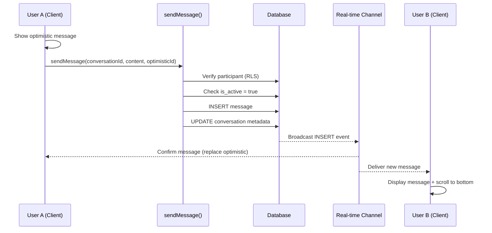

# Chat Messaging

## Purpose
Real-time 1:1 message exchange with Supabase subscriptions and optimistic UI updates.

## Scope
- **In scope:** Message sending, receiving, real-time delivery, optimistic updates
- **Out of scope:** Timer logic (see [Timer System](./timer-system.md)), AI interjections (see [AI Interjections](./ai-interjections.md))

## Dependencies
- [Message](../data-models/message.md) for data model
- [Conversation](../data-models/conversation.md) for parent entity
- [Chat Actions](../api/chat-actions.md) for API
- [Supabase Patterns](../infrastructure/supabase-patterns.md) for real-time

---

## Message Flow



---

## Sending Messages

### Prerequisites
1. User must be authenticated (`auth.uid()` available)
2. User must be participant in conversation (enforced by RLS)
3. Conversation must be active (`is_active = true`)

### sendMessage() Flow

1. **Verify Membership:**
   ```sql
   SELECT user_id FROM participants
   WHERE conversation_id = ? AND user_id = auth.uid()
   ```
   If not found → return `false`

2. **Check Active Status:**
   ```sql
   SELECT is_active FROM conversations
   WHERE id = ?
   ```
   If `is_active = false` → return `false`

3. **Insert Message:**
   ```sql
   INSERT INTO messages (id, conversation_id, sender_id, content, is_ai_generated)
   VALUES (?, ?, auth.uid(), ?, false)
   ```

4. **Update Conversation Metadata:**
   - Set `last_message_sender_id = auth.uid()`
   - Add current user to `user_ids_who_messaged` (if not present)
   - Clear timer if both users have messaged (see [Timer System](./timer-system.md))

5. **Trigger AI Evaluation:** (non-blocking)
   ```typescript
   evaluateConversationState(conversationId, profiles).then(shouldSpeak => {
     if (shouldSpeak) generateTrioResponse(conversationId, profiles)
   })
   ```

6. **Return Success:** `return true`

### Error Handling

| Error | Response | User Feedback |
|-------|----------|---------------|
| Not authenticated | return `false` | "Please log in" |
| Not participant | return `false` | "You don't have access to this conversation" |
| Conversation archived | return `false` | "This conversation has expired" |
| Database error | return `false` | "Failed to send message. Please try again." |
| AI evaluation error | log error, continue | (No feedback - AI is optional) |

---

## Receiving Messages

### Real-time Subscription

```typescript
const channel = supabase
  .channel(`messages:${conversationId}`)
  .on(
    'postgres_changes',
    {
      event: 'INSERT',
      schema: 'public',
      table: 'messages',
      filter: `conversation_id=eq.${conversationId}`
    },
    (payload) => {
      const newMessage = payload.new as Message
      setMessages(prev => [...prev, newMessage])
      scrollToBottom()
      removeOptimistic(newMessage.id)
    }
  )
  .subscribe()

// Cleanup
return () => {
  supabase.removeChannel(channel)
}
```

### Message Ordering
Messages displayed chronologically (oldest → newest):
```sql
SELECT * FROM messages
WHERE conversation_id = ?
ORDER BY created_at ASC
```

---

## Optimistic UI Updates

### Purpose
Show message immediately in UI before server confirmation. Improves perceived performance.

### Implementation

1. **Generate Optimistic ID:**
   ```typescript
   const optimisticId = crypto.randomUUID()
   ```

2. **Add to Local State:**
   ```typescript
   const optimisticMessage = {
     id: optimisticId,
     conversation_id: conversationId,
     sender_id: currentUserId,
     content: inputValue,
     created_at: new Date().toISOString(),
     is_ai_generated: false
   }
   setMessages(prev => [...prev, optimisticMessage])
   ```

3. **Send to Server:**
   ```typescript
   const success = await sendMessage(conversationId, inputValue, optimisticId)
   ```

4. **Handle Real Message:**
   - On real-time event, check if `id === optimisticId`
   - If match, remove optimistic, add real message
   - If no match, just add real message (optimistic already removed)

5. **Handle Failure:**
   ```typescript
   if (!success) {
     removeOptimistic(optimisticId)
     toast.error('Failed to send message')
   }
   ```

---

## Message Display

### User Messages
```tsx
<MessageBubble
  message={message}
  isOwn={message.sender_id === currentUserId}
  isTrio={false}
/>
```

Styling:
- Own messages: right-aligned, teal background
- Partner messages: left-aligned, sand background

### Trio Messages
```tsx
<MessageBubble
  message={message}
  isOwn={false}
  isTrio={message.is_ai_generated}
/>
```

Styling:
- Gradient background (rust → mustard)
- Italic text
- "Trio" label/avatar

### Auto-scroll
Scroll to bottom on:
- New message received
- User sends message
- Component mounts

```typescript
const scrollToBottom = () => {
  messagesEndRef.current?.scrollIntoView({ behavior: 'smooth' })
}

useEffect(() => {
  scrollToBottom()
}, [messages])
```

---

## Business Rules

1. **Message Length:** No enforced limit (PostgreSQL text type)
2. **Rate Limiting:** None currently (future: 10 messages/minute per user)
3. **Edit/Delete:** Not supported (messages are immutable)
4. **Read Receipts:** Not implemented
5. **Typing Indicators:** Not implemented
6. **AI Evaluation:** Runs after every user message (non-blocking)

---

## Performance Considerations

| Aspect | Current | Optimization Opportunity |
|--------|---------|--------------------------|
| Message history | Load all messages | Pagination (50 at a time) |
| Real-time latency | < 100ms | (Already optimal) |
| Optimistic updates | Yes | (Already optimal) |
| Message list rendering | Standard | Virtual scrolling for long conversations |

---

## Acceptance Criteria

- [ ] sendMessage() returns false if user not participant
- [ ] sendMessage() returns false if conversation archived
- [ ] Messages appear immediately via optimistic updates
- [ ] Real message replaces optimistic on confirmation
- [ ] Failed messages show error toast and remove optimistic
- [ ] Real-time subscription delivers messages < 100ms
- [ ] Messages ordered chronologically (created_at ASC)
- [ ] Auto-scroll on new message (user and partner)
- [ ] Trio messages visually distinct from user messages
- [ ] AI evaluation triggered after user message (non-blocking)
