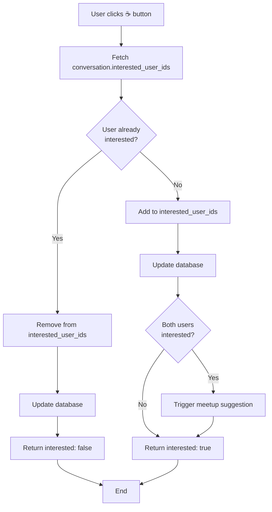

# Interest Tracking

## Purpose
Double-blind interest mechanism where neither user sees other's status until both click interested (☕).

## Scope
- **In scope:** Interest toggle logic, double-blind mechanism, meetup trigger
- **Out of scope:** Meetup suggestion generation (see [Meetup Suggestions](./meetup-suggestions.md))

## Dependencies
- [Conversation](../data-models/conversation.md) for data model
- [Meetup Suggestions](./meetup-suggestions.md) for trigger target
- [Glossary](../shared/glossary.md) for terminology

---

## markInterested() Function

### Purpose
Toggle user's interested status and trigger meetup suggestion when both users interested.

### Input
```typescript
{
  conversationId: string
}
```

### Output
```typescript
{
  interested: boolean  // true if now interested, false if toggled off
}
```

---

## Toggle Logic



---

## Toggle Off Logic

### When: User is Currently Interested

```typescript
const currentIds: string[] = conv.interested_user_ids || []
const isCurrentlyInterested = currentIds.includes(user.id)

if (isCurrentlyInterested) {
  // Remove user from list
  const newIds = currentIds.filter(id => id !== user.id)
  const updatePayload: any = { interested_user_ids: newIds }

  // If meetup not sent yet, cancel trigger
  if (!conv.meetup_suggested && conv.meetup_trigger_after) {
    updatePayload.meetup_trigger_after = null
  }

  await adminClient
    .from('conversations')
    .update(updatePayload)
    .eq('id', conversationId)

  return { interested: false }
}
```

### Actions
1. Remove `user.id` from `interested_user_ids` array
2. If `meetup_suggested = false` AND `meetup_trigger_after` set, clear trigger
3. Return `interested: false`

---

## Toggle On Logic

### When: User is Not Currently Interested

```typescript
const newIds = [...currentIds, user.id]
const updatePayload: any = { interested_user_ids: newIds }

let shouldTriggerMeetup = false

// If both users now interested and no meetup sent yet
if (newIds.length >= 2 && !conv.meetup_suggested) {
  updatePayload.meetup_suggested = true
  shouldTriggerMeetup = true
}

await adminClient
  .from('conversations')
  .update(updatePayload)
  .eq('id', conversationId)

if (shouldTriggerMeetup) {
  // Fire in background
  generateMeetupSuggestion(conversationId).catch(err =>
    console.error('Meetup suggestion error:', err)
  )
}

return { interested: true }
```

### Actions
1. Add `user.id` to `interested_user_ids` array
2. Check if both users now interested (`newIds.length >= 2`)
3. If both interested AND `meetup_suggested = false`:
   - Set `meetup_suggested = true`
   - Call `generateMeetupSuggestion()` in background
4. Return `interested: true`

---

## Double-Blind Mechanism

### Privacy Rule
Neither user sees other's interest status until BOTH have clicked interested.

### UI Display

**State 1: Neither Interested**
```tsx
<button onClick={handleInterested}>
  ☕  {/* Simple icon */}
</button>
```

**State 2: Current User Interested, Partner Not**
```tsx
<button onClick={handleInterested} className="active">
  ☕️ Interested  {/* Icon + text, teal background */}
</button>
```
- Current user sees their own status (teal button)
- Current user does NOT see partner's status
- Partner sees default button (doesn't know user clicked)

**State 3: Both Interested (Mutual)**
```tsx
<div className="mutual-interest-banner">
  ☕️ You both want to meet! Trio is preparing suggestions...
</div>
```
- Reveal shown only after both click
- Meetup suggestion posted shortly after

---

## Meetup Trigger Conditions

### Requirements

All must be true:

1. **Both users interested:** `interested_user_ids.length >= 2`
2. **No previous suggestion:** `meetup_suggested = false`
3. **User just toggled ON:** (checked in toggle-on branch)

### Trigger Action

```typescript
// Set flag first (prevents duplicate)
await adminClient
  .from('conversations')
  .update({ meetup_suggested: true })
  .eq('id', conversationId)

// Fire generation in background (non-blocking)
generateMeetupSuggestion(conversationId).catch(err =>
  console.error('Meetup suggestion error:', err)
)
```

**Key:** Flag set synchronously, generation runs asynchronously. User doesn't wait.

---

## Conversation Metadata

### Fields Used

| Field | Type | Purpose |
|-------|------|---------|
| `interested_user_ids` | UUID[] | Track who clicked interested |
| `meetup_suggested` | boolean | Prevent duplicate suggestions |
| `meetup_trigger_after` | int | (Legacy) Unused in current implementation |

### meetup_trigger_after (Legacy)

**Original Design:** Trigger meetup after both interested + N messages sent

**Current Design:** Trigger immediately when both interested

**Status:** Field kept for backwards compatibility but unused

---

## Business Rules

1. **Toggle Behavior:** Clicking button toggles interested status on/off
2. **Double-Blind:** Partner's status hidden until both interested
3. **One-Time Suggestion:** Flag `meetup_suggested` prevents duplicates
4. **Immediate Trigger:** Meetup generation starts as soon as both interested (no message threshold)
5. **Background Generation:** User receives immediate response, suggestion appears later (~10 seconds)
6. **Cancellation:** Toggling off before meetup sent clears trigger

---

## Edge Cases

| Scenario | Behavior |
|----------|----------|
| User A interested, User B not | A sees active button, B sees default |
| User A toggles off | A's status removed, meetup cancelled if not sent |
| Both toggle on simultaneously | Both added to array, meetup triggered once |
| User toggles on after meetup sent | Button stays active, no new meetup |
| Meetup generation fails | Silent failure (user doesn't know) |
| User refreshes page | Interest state persists (stored in DB) |

---

## UI Components

### Interested Button
```tsx
const [isInterested, setIsInterested] = useState(false)

const handleInterested = async () => {
  const result = await markInterested(conversationId)
  setIsInterested(result.interested)

  if (result.interested) {
    toast.info('Great! Waiting for your partner...')
  } else {
    toast.info('Interest removed')
  }
}

return (
  <button
    onClick={handleInterested}
    className={`interested-btn ${isInterested ? 'active' : ''}`}
  >
    {isInterested ? '☕️ Interested' : '☕'}
  </button>
)
```

### Styling
```css
.interested-btn {
  background: transparent;
  border: 2px solid #2B6B6E;
  color: #2B6B6E;
  border-radius: 20px;
  padding: 8px 16px;
}

.interested-btn.active {
  background: #2B6B6E;
  color: #F9F8F4;
}
```

---

## Acceptance Criteria

- [ ] markInterested() toggles user's interested status
- [ ] Toggle on adds user to interested_user_ids
- [ ] Toggle off removes user from interested_user_ids
- [ ] Partner cannot see user's interest until both interested
- [ ] Meetup suggestion triggered when both users interested
- [ ] meetup_suggested flag prevents duplicate suggestions
- [ ] Meetup generation runs in background (non-blocking)
- [ ] Toggle off before meetup clears trigger
- [ ] UI button shows active state when user interested
- [ ] Toast notification on toggle (feedback to user)
