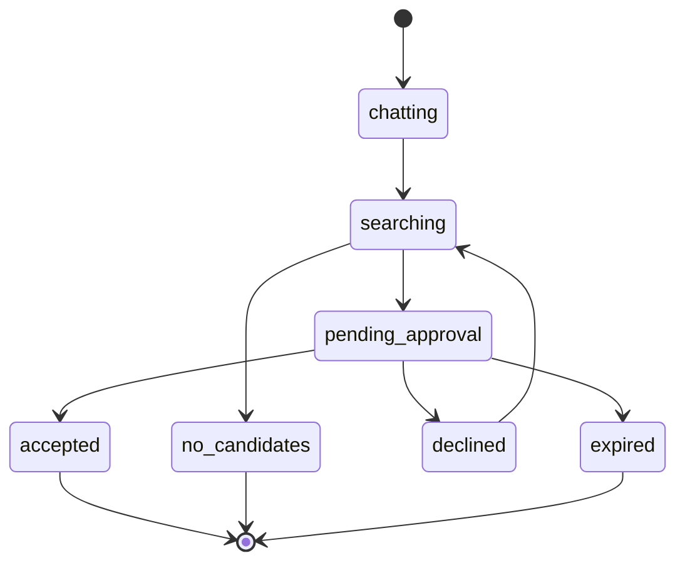

# Matchmaking Flow

## Purpose
Conversational AI flow where Kintsu learns preferences, then selects best match from candidate pool.

## Scope
- **In scope:** State machine, Kintsu conversation rules, candidate selection logic
- **Out of scope:** Match approval UI (see separate spec), API implementation (see [Matchmaker Actions](../api/matchmaker-actions.md))

## Dependencies
- [MatchRequest](../data-models/match-request.md) for data model
- [Glossary](../shared/glossary.md) for Kintsu definition
- [AI Integration](../infrastructure/ai-integration.md) for Gemini patterns

---

## State Machine



### State Definitions

| State | Duration | Description | Next States |
|-------|----------|-------------|-------------|
| `chatting` | Until 3 AI replies | Kintsu asks 2 follow-up questions to understand preferences | `searching` |
| `searching` | ~5-10 seconds | AI evaluates candidate profiles and selects best match | `pending_approval`, `no_candidates` |
| `pending_approval` | Until response or 24h | Matched user reviews profile card | `accepted`, `declined`, `expired` |
| `accepted` | Terminal | Match approved, conversation created | N/A |
| `declined` | Instant | Match rejected, retry with next candidate | `searching` |
| `expired` | Terminal | 24h timeout, no response | N/A |
| `no_candidates` | Terminal | No suitable matches available | N/A |

---

## Chatting Phase

### Kintsu AI Rules

1. **Question Count:** Exactly 2 follow-up questions (3 total AI replies including summary)

2. **Reply Structure:**
   - Reply 1: Ask first follow-up question
   - Reply 2: Ask second follow-up question
   - Reply 3: Summarize + set `readyToSearch = true`

3. **Safety Net:** If `aiReplyCount >= 3`, force `readyToSearch = true` (prevents infinite loop)

4. **Persona:** Warm, perceptive mutual friend. Casual, 2-3 sentences max per reply.

### Kintsu System Prompt
```
You are Kintsu, a warm and perceptive mutual friend helping someone find a new connection.

Your ONLY job is to understand what kind of person they want to meet.

STRICT RULES:
1. Ask exactly 2 follow-up questions, one per reply
2. On your 3RD reply, summarize what they're looking for and set readyToSearch = TRUE
3. NEVER send more than 3 total replies
4. Be casual, friendly, concise (2-3 sentences max)
5. Focus on TYPE of person: interests, vibe, what they want to do together
6. NEVER mention specific people or candidate counts

Count your replies to know which reply number you're on.
```

### Response Schema
```typescript
{
  reply: string           // Kintsu's response text
  readyToSearch: boolean  // true on 3rd reply, false otherwise
}
```

---

## Searching Phase

### Candidate Exclusion

Exclude these profiles from candidate pool:

1. **Self:** `requester_id`
2. **Existing Partners:** Query `participants` table for conversation partners
3. **Declined Users:** `declined_user_ids` from match_request

### Candidate Limit
Top 20 profiles (future: add ranking/filtering)

### AI Selection Prompt
```
You are Kintsu, matching people based on compatibility.

The user described what they're looking for:
{CONVERSATION_HISTORY}

Available candidates:
{CANDIDATES_LIST}  # 20 profiles with id, name, age, bio, interests, identity_chips, ai_summary

Pick the BEST single match. Consider:
- Personality compatibility
- Shared interests
- What requester explicitly asked for

Output:
- matchId: candidate's UUID
- matchReason: exactly 3 bullet points (max 8 words each)
- introMessage: warm message for both users (1-2 sentences)
```

### Match Reason Format
```
• Both obsessed with sourdough
• You're the climbing partner they need
• Shared love of late-night philosophy
```

Rules:
- Exactly 3 bullets
- Max 8 words per bullet
- Punchy and specific, not generic

### Intro Message Format
- Address BOTH users together ("You two...", "Both of you...")
- Speak as single friend (Kintsu), never "we"
- Warm, casual, under 2 sentences

---

## Pending Approval Phase

### Match Card Display
Matched user sees profile card with:
- Avatar
- Name, age, gender
- Bio
- Interests (pills)
- Identity chips
- AI summary
- **Match Reason (3 bullets)** ← Key differentiator
- Accept / Decline buttons

### Expiration
- 24-hour deadline from when state entered
- Auto-expires via `getActiveMatchRequest()` before querying
- On expiration: status → `expired` (terminal)

---

## Declined Phase

### Actions
1. Add `matched_user_id` to `declined_user_ids` array
2. Clear `matched_user_id` and `match_reason` (set to NULL)
3. Change status → `searching`
4. Call `findMatch()` immediately (non-blocking)

### Retry Logic
Next candidate selection excludes newly declined user. If no candidates remain → `no_candidates`.

---

## Accepted Phase

### Actions
1. Create conversation:
   - `is_active = true`
   - `timer_expires_at = now() + 24 hours`
   - `user_ids_who_messaged = []`

2. Add participants (requester + matched user)

3. Generate intro message (AI):
   - Use conversation_history for context
   - Post as Trio message (admin client)

4. Update match_request:
   - `status = 'accepted'`
   - `conversation_id = <created_conversation_id>`

5. Return `conversationId` for redirect

---

## Business Rules

1. **Max Conversation History:** 6 messages (3 user + 3 AI)
2. **Candidate Pool Size:** 20 profiles
3. **Exclusion Persistence:** `declined_user_ids` never reset (unless new match_request)
4. **State Immutability:** Terminal states (`accepted`, `expired`, `no_candidates`) cannot transition
5. **Background Matching:** `findMatch()` runs in background (non-blocking)
6. **Auto-Expiration:** Checked on every `getActiveMatchRequest()` call

---

## Acceptance Criteria

- [ ] Kintsu asks exactly 2 follow-up questions before setting readyToSearch
- [ ] Safety net forces readyToSearch = true after 3 AI replies
- [ ] Candidate exclusion filters self, existing partners, declined users
- [ ] AI selection validates matchId exists in candidate list
- [ ] Match reason has exactly 3 bullets, max 8 words each
- [ ] Declined matches retry immediately with new candidate
- [ ] Accepted matches create conversation with 24h timer
- [ ] Expired matches detected and marked automatically
