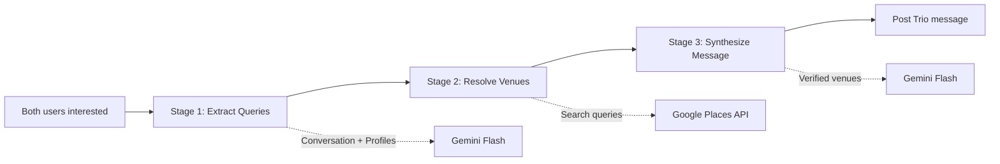

# Meetup Suggestions

## Purpose
3-stage RAG pipeline generating verified venue recommendations when both users mark interested.

## Scope
- **In scope:** 3-stage pipeline (Extract → Resolve → Synthesize), Google Places API integration
- **Out of scope:** Interest tracking logic (see [Interest Tracking](./interest-tracking.md))

## Dependencies
- [Glossary](../shared/glossary.md) for RAG pipeline terms
- [Interest Tracking](./interest-tracking.md) for trigger mechanism
- [AI Integration](../infrastructure/ai-integration.md) for Gemini patterns

---

## 3-Stage RAG Pipeline



### Why 3 Stages?

1. **Hallucination Prevention:** AI can't invent venues (Stage 2 validates)
2. **Quality:** Real places with Google Maps links
3. **Context-Aware:** Extracts preferences from conversation history, prioritizes places users already named

---

## Stage 1: Extract Queries

**Purpose:** Analyze conversation to generate specific Google Maps search queries.

**Input:** Last 20 messages, both users' profiles (interests, bio)

**Response Schema:**
```typescript
{
  queries: string[]         // Exactly 2 queries
  locationContext: string   // City/area if mentioned or ""
}
```

**Priority Rule:** If users explicitly mention a specific place name in conversation (e.g. "let's meet at Blue Bottle Coffee"), that exact name MUST be used as one of the queries. Already-mentioned places take priority over generated suggestions.

**Example:** `{"queries": ["bouldering gym", "board game cafe"], "locationContext": "New Haven"}`

---

## Stage 2: Resolve Venues

**Purpose:** Query Google Places API to get real, verified venues.

**API:** `https://places.googleapis.com/v1/places:searchText`
**Fields:** `displayName`, `formattedAddress`, `googleMapsUri`, `primaryType`
**Selection:** Top result only

### Verified Venue Object
```typescript
interface MeetupPlace {
  name: string              // displayName
  category: string          // primaryType (underscores replaced with spaces)
  mapsQuery: string         // "{name} {address}" for search
  googleMapsUri: string     // Direct Google Maps link
  address: string           // formattedAddress
}
```

### Error Handling
- API error → return `null`
- No results → return `null`
- Invalid response → return `null`

### Minimum Venues
Pipeline continues only if >= 1 venue resolved. Ideally 2 venues.

---

## Stage 3: Synthesize Message

**Purpose:** Generate warm, natural message suggesting the VERIFIED venues.

**Input:** Conversation history, user profiles, verified venues list

**Context Rule:** If users already agreed on a place in conversation, the message should acknowledge that (e.g. "Great idea! Here's the info for that spot...") rather than suggesting a different place.

**Response Schema:**
```typescript
{ message: string }  // Warm message with venue names
```

**Example:** `"You two should check out Rock Climb Fairfield for a climbing session, then grab ramen at Ramen House after! 🍜🧗"`

---

## Message Storage

### Content Format

Message stored with special encoding:

```
{message text}

[MEETUP_PLACES]{json}[/MEETUP_PLACES]
```

**Full Example:**
```
You two should check out Rock Climb Fairfield and grab ramen after!

[MEETUP_PLACES][{"name":"Rock Climb Fairfield","category":"gym","googleMapsUri":"https://...","address":"123 Main St, Fairfield, CT"}][/MEETUP_PLACES]
```

### Database Insert
```typescript
const placesJson = JSON.stringify(result.places)
const fullContent = `${result.message}\n\n[MEETUP_PLACES]${placesJson}[/MEETUP_PLACES]`

await adminClient.from('messages').insert({
  conversation_id: conversationId,
  sender_id: trioId,
  content: fullContent,
  is_ai_generated: true
})
```

### UI Parsing
```typescript
const meetupPlacesMatch = content.match(/\[MEETUP_PLACES\](.*?)\[\/MEETUP_PLACES\]/s)
if (meetupPlacesMatch) {
  const places = JSON.parse(meetupPlacesMatch[1]) as MeetupPlace[]
  // Render place cards
}
```

---

## Conversation Metadata Update

After successful generation:

```typescript
await adminClient
  .from('conversations')
  .update({ meetup_suggested: true })
  .eq('id', conversationId)
```

**Purpose:** Prevent duplicate meetup suggestions (flag checked before triggering).

---

## Business Rules

1. **Trigger:** Both users must mark interested AND `meetup_suggested = false`
2. **Venue Count:** Must resolve >= 1 venue (preferably 2) to proceed
3. **No Hallucinations:** Only venues from Google Places API suggested
4. **Location Context:** Optional - used to improve search relevance
5. **One-time:** Each conversation gets max 1 meetup suggestion
6. **Non-blocking:** Pipeline runs in background (user doesn't wait)
7. **Query Limit:** Exactly 2 search queries generated

---

## Error Handling

| Stage | Error | Behavior |
|-------|-------|----------|
| Stage 1 | AI fails | Return `null`, skip suggestion |
| Stage 1 | Invalid JSON | Return `null`, skip suggestion |
| Stage 2 | API error | Return `null` for that venue |
| Stage 2 | No results | Return `null` for that venue |
| Stage 2 | < 1 venue resolved | Skip to Stage 3 with empty list, abort |
| Stage 3 | AI fails | Return `null`, skip suggestion |
| Any | Exception | Log error, return `null`, skip suggestion |

**Key:** All errors result in no meetup suggestion. Better to skip than hallucinate.

---

## Performance

| Stage | Latency | Notes |
|-------|---------|-------|
| Stage 1 | ~2-3 seconds | Gemini Flash |
| Stage 2 | ~1-2 seconds per venue | Google Places API (parallel) |
| Stage 3 | ~2-3 seconds | Gemini Flash |
| **Total** | ~7-10 seconds | User doesn't wait (background) |

---

## Example Flow

**Conversation:** Users discuss bouldering in New Haven/Fairfield

**Stage 1:** `{"queries": ["bouldering gym", "ramen restaurant"], "locationContext": "New Haven"}`

**Stage 2:** Returns Rock Climb Fairfield (gym) and Mecha Noodle Bar (restaurant) with Google Maps URIs

**Stage 3:** `"You two should hit Rock Climb Fairfield for a session, then grab ramen at Mecha Noodle Bar after! 🍜🧗"`

---

## Acceptance Criteria

- [ ] Stage 1 generates exactly 2 search queries
- [ ] Stage 1 prioritizes place names already mentioned by users over generated suggestions
- [ ] Stage 1 extracts location context if mentioned in conversation
- [ ] Stage 2 calls Google Places API for each query
- [ ] Stage 2 returns verified venues with all required fields
- [ ] Stage 3 references ONLY verified venue names (no hallucinations)
- [ ] Message content includes [MEETUP_PLACES] JSON payload
- [ ] meetup_suggested flag prevents duplicate suggestions
- [ ] Pipeline aborts if < 1 venue resolved
- [ ] Trio message posted via admin client
- [ ] UI parses and displays place cards with Google Maps links
