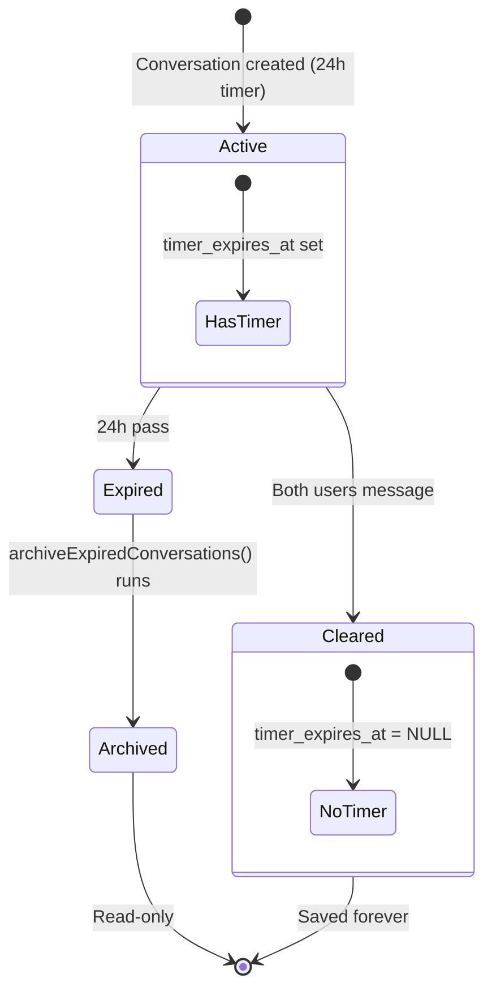
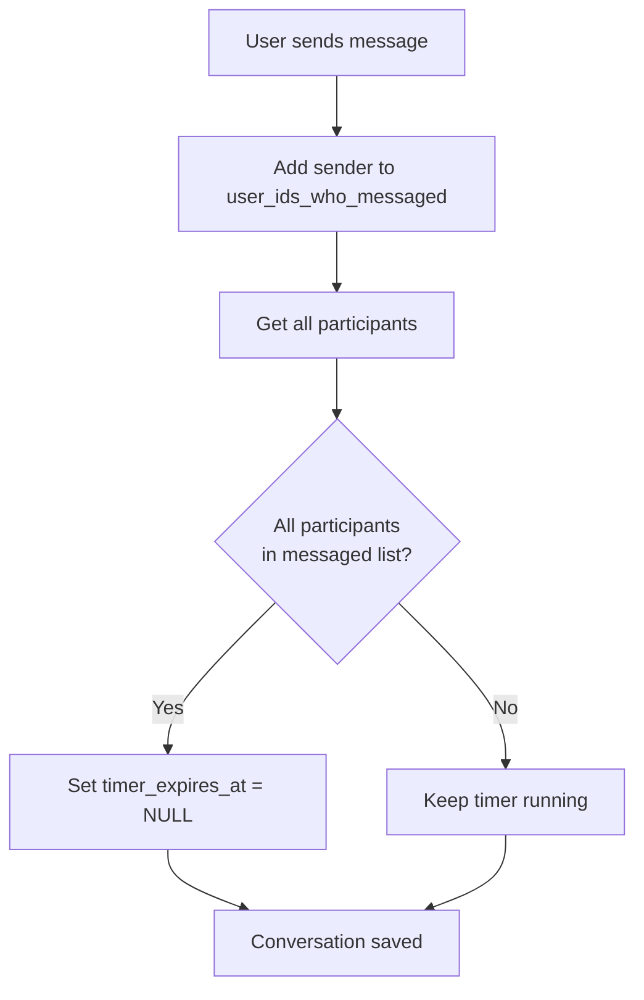

# Timer System

## Purpose
24-hour countdown that archives conversations if both users don't message. Encourages engagement.

## Scope
- **In scope:** Timer creation, clearing logic, expiration, archiving
- **Out of scope:** Message sending (see [Chat Messaging](./chat-messaging.md)), UI display (implementation detail)

## Dependencies
- [Conversation](../data-models/conversation.md) for data model
- [Glossary](../shared/glossary.md) for timer terms

---

## Timer Lifecycle



---

## Timer Creation

### When: Conversation Created (Match Accepted)

```typescript
const conversation = {
  is_active: true,
  timer_expires_at: new Date(Date.now() + 24 * 60 * 60 * 1000).toISOString(),
  user_ids_who_messaged: []
}
```

### Initial State
- `is_active = true`
- `timer_expires_at = now() + 24 hours`
- `user_ids_who_messaged = []` (empty)

---

## Timer Clearing

### Trigger: Both Users Send Message



### Logic

```typescript
// In sendMessage() after inserting message

// Get current messaged list
const currentMessaged: string[] = conversation.user_ids_who_messaged || []

// Add sender if not present
const updatedMessaged = currentMessaged.includes(sender_id)
  ? currentMessaged
  : [...currentMessaged, sender_id]

// Get all participants
const participants = await supabase
  .from('participants')
  .select('user_id')
  .eq('conversation_id', conversationId)

const participantIds = participants.map(p => p.user_id)

// Check if all have messaged
const allHaveMessaged = participantIds.every(pid => updatedMessaged.includes(pid))

// Update conversation
const updatePayload: any = {
  last_message_sender_id: sender_id,
  user_ids_who_messaged: updatedMessaged
}

if (allHaveMessaged) {
  updatePayload.timer_expires_at = null  // Clear timer!
}

await supabase
  .from('conversations')
  .update(updatePayload)
  .eq('id', conversationId)
```

### Key Rule
Timer clears when **ALL** participants are in `user_ids_who_messaged`, regardless of message order.

Example:
- User A messages → `user_ids_who_messaged = [A]`, timer still running
- User B messages → `user_ids_who_messaged = [A, B]`, timer clears

---

## Timer Expiration

### When: timer_expires_at < now()

Conversations expire when deadline passes without both users messaging.

### Auto-Expiration Check

Performed on every `getActiveMatchRequest()` call:

```typescript
// Expire stale conversations
await adminClient
  .from('conversations')
  .update({ is_active: false })
  .eq('is_active', true)
  .not('timer_expires_at', 'is', null)
  .lt('timer_expires_at', new Date().toISOString())
```

---

## Conversation Archiving

### Function: archiveExpiredConversations()

**Purpose:** Background job to mark expired conversations as archived.

**Execution:** Cron job (every 5 minutes) or manual trigger.

**Query:**
```sql
UPDATE conversations
SET is_active = false
WHERE is_active = true
  AND timer_expires_at IS NOT NULL
  AND timer_expires_at < now()
RETURNING id
```

**Logging:**
```typescript
if (data && data.length > 0) {
  console.log(`Archived ${data.length} expired conversation(s):`, conversationIds)
}
```

**Return:** Count of archived conversations

---

## Archived Conversation Behavior

### is_active = false

When conversation is archived:

1. **Read-only:** New messages rejected by `sendMessage()`:
   ```typescript
   const { data: conv } = await supabase
     .from('conversations')
     .select('is_active')
     .eq('id', conversationId)
     .single()

   if (!conv.is_active) {
     console.log('Cannot send message: conversation is archived')
     return false
   }
   ```

2. **UI Display:**
   - Show "This conversation has expired" banner
   - Disable message input
   - Show conversation in "Archived" filter

3. **Timer Display:**
   - No timer shown (expired)
   - Expiration timestamp shown ("Expired 2 days ago")

---

## Timer Display (UI)

### Active Timer
```typescript
const timeRemaining = timerExpiresAt
  ? Math.max(0, new Date(timerExpiresAt).getTime() - Date.now())
  : null

if (timeRemaining !== null) {
  const hours = Math.floor(timeRemaining / (1000 * 60 * 60))
  const minutes = Math.floor((timeRemaining % (1000 * 60 * 60)) / (1000 * 60))
  return `⏰ ${hours}h ${minutes}m remaining`
}
```

### Cleared Timer
```typescript
if (timerExpiresAt === null) {
  return null  // No timer display
}
```

### Update Frequency
Timer display updates every minute (or on message send).

---

## Business Rules

1. **Timer Duration:** Fixed 24 hours (no configuration)
2. **Clearing Requirement:** Both users must message (not alternating)
3. **Archival Trigger:** Background job (not automatic on expiration)
4. **Read-only After Archive:** No new messages, but history viewable
5. **No Reactivation:** Once archived, conversation cannot be un-archived
6. **No Expiration Extension:** Timer cannot be extended

---

## Edge Cases

| Scenario | Behavior |
|----------|----------|
| User A messages twice before User B | Timer still running (need B's message) |
| User B messages after timer expires but before archival | Accepted (race condition grace period) |
| Both users message simultaneously | Both added to `user_ids_who_messaged`, timer clears |
| User deletes message (not supported) | N/A - messages immutable |
| Conversation created without timer | Possible (timer_expires_at = NULL on creation) |

---

## Performance

### Query Efficiency
- Indexed query: `idx_conversations_timer` on `timer_expires_at WHERE timer_expires_at IS NOT NULL`
- Average archival query time: < 50ms

### Background Job
- Frequency: Every 5 minutes
- Overhead: Minimal (only updates expired conversations)
- Locks: None (simple UPDATE query)

---

## Acceptance Criteria

- [ ] Timer set to 24h on conversation creation
- [ ] Timer clears when both users send at least one message
- [ ] Expired conversations detected and archived by background job
- [ ] Archived conversations reject new messages
- [ ] Timer display shows hours and minutes remaining
- [ ] Cleared timer (NULL) shows no timer UI
- [ ] archiveExpiredConversations() runs without errors
- [ ] Archived conversations queryable with is_active = false filter
